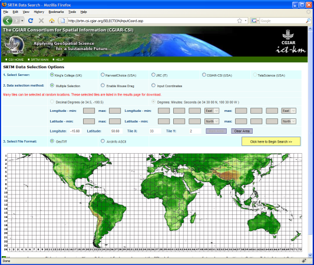
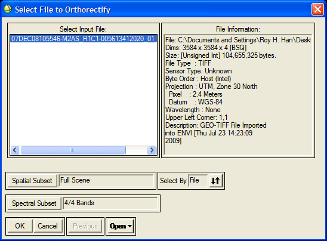
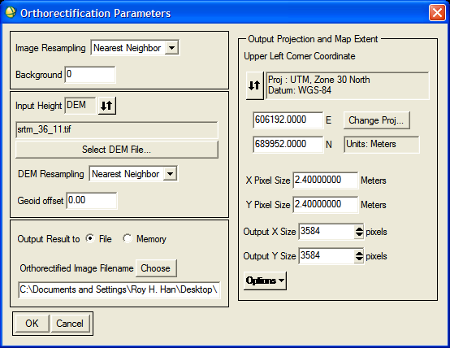

Orthorectify satellite images with ENVI
=======================================
Image providers such as `DigitalGlobe <http://www.digitalglobe.com>`_ strongly recommend orthorectifying satellite images to guarantee geo-accuracy.  Orthorectification is the process of correcting an acquired image using an elevation model so that georeferenced pixels in the image roughly correspond to what one would see if one were flying directly over that geolocation.  In this tutorial, you will learn how to orthorectify an image using a geospatial analysis software package called ENVI.

.. raw:: html

    <object width="425" height="344"><param name="movie" value="http://www.youtube.com/v/Hn64_StrB-8&hl=en&fs=1&rel=0"></param><param name="allowFullScreen" value="true"></param><param name="allowscriptaccess" value="always"></param><embed src="http://www.youtube.com/v/Hn64_StrB-8&hl=en&fs=1&rel=0" type="application/x-shockwave-flash" allowscriptaccess="always" allowfullscreen="true" width="425" height="344"></embed></object>

Requirements
------------
* `ENVI <http://www.ittvis.com/ProductServices/ENVI.aspx>`_ 

Walkthrough
-----------

Locate satellite images
^^^^^^^^^^^^^^^^^^^^^^^
First locate your images.  Below are the typical contents of satellite data acquired from the QuickBird satellite.
::

    005613412020_01_P001_MUL/
        07DEC08105546-M2AS-005613412020_01_P001-BROWSE.JPG
        07DEC08105546-M2AS-005613412020_01_P001.IMD
        07DEC08105546-M2AS-005613412020_01_P001.RPB
        07DEC08105546-M2AS-005613412020_01_P001.TIL
        07DEC08105546-M2AS-005613412020_01_P001.XML
        07DEC08105546-M2AS-005613412020_01_P001_README.TXT
        07DEC08105546-M2AS_R1C1-005613412020_01_P001.TIF
        07DEC08105546-M2AS_R1C1-005613412020_01_P001.aux
        07DEC08105546-M2AS_R1C2-005613412020_01_P001.TIF
        07DEC08105546-M2AS_R2C1-005613412020_01_P001.TIF
        07DEC08105546-M2AS_R2C1-005613412020_01_P001.aux
        07DEC08105546-M2AS_R2C2-005613412020_01_P001.TIF
        EDUCATIONAL.TXT
    005613412020_01_P001_PAN/
        07DEC08105546-P2AS-005613412020_01_P001-BROWSE.JPG
        07DEC08105546-P2AS-005613412020_01_P001-BROWSE.JPG.xml
        07DEC08105546-P2AS-005613412020_01_P001.IMD
        07DEC08105546-P2AS-005613412020_01_P001.RPB
        07DEC08105546-P2AS-005613412020_01_P001.TIL
        07DEC08105546-P2AS-005613412020_01_P001.XML
        07DEC08105546-P2AS-005613412020_01_P001_README.TXT
        07DEC08105546-P2AS_R1C1-005613412020_01_P001.TIF
        07DEC08105546-P2AS_R1C1-005613412020_01_P001.TIF.xml
        07DEC08105546-P2AS_R1C1-005613412020_01_P001.aux
        07DEC08105546-P2AS_R1C2-005613412020_01_P001.TIF
        07DEC08105546-P2AS_R1C2-005613412020_01_P001.aux
        07DEC08105546-P2AS_R2C1-005613412020_01_P001.TIF
        07DEC08105546-P2AS_R2C1-005613412020_01_P001.aux
        07DEC08105546-P2AS_R2C2-005613412020_01_P001.TIF
        07DEC08105546-P2AS_R2C2-005613412020_01_P001.aux
        EDUCATIONAL.TXT
    GIS_FILES/
        005613412020_01_ORDER_SHAPE.dbf
        005613412020_01_ORDER_SHAPE.shp
        005613412020_01_ORDER_SHAPE.shp.xml
        005613412020_01_ORDER_SHAPE.shx
        005613412020_01_PRODUCT_SHAPE.dbf
        005613412020_01_PRODUCT_SHAPE.shp
        005613412020_01_PRODUCT_SHAPE.shx
        005613412020_01_STRIP_SHAPE.dbf
        005613412020_01_STRIP_SHAPE.shp
        005613412020_01_STRIP_SHAPE.shx
        005613412020_01_TILE_SHAPE.dbf
        005613412020_01_TILE_SHAPE.shp
        005613412020_01_TILE_SHAPE.shx
    005613412020_01_LAYOUT.JPG
    005613412020_01_LAYOUT.JPG.aux.xml
    005613412020_01_LAYOUT.JPG.xml
    005613412020_01_LAYOUT.aux
    005613412020_01_LAYOUT.rrd
    005613412020_01_README.TXT
    005613412020_01_README.XML
    schema.ini

The ``005613412020_01_P001_MUL`` folder contains the multispectral images and the ``005613412020_01_P001_PAN`` folder contains the corresponding panchromatic images.  Here we have rearranged the files into pairs.
::

    07DEC08105546-M2AS_R1C1-005613412020_01_P001.TIF
    07DEC08105546-P2AS_R1C1-005613412020_01_P001.TIF

    07DEC08105546-M2AS_R1C2-005613412020_01_P001.TIF
    07DEC08105546-P2AS_R1C2-005613412020_01_P001.TIF

    07DEC08105546-M2AS_R2C1-005613412020_01_P001.TIF
    07DEC08105546-P2AS_R2C1-005613412020_01_P001.TIF

    07DEC08105546-M2AS_R2C2-005613412020_01_P001.TIF
    07DEC08105546-P2AS_R2C2-005613412020_01_P001.TIF

Locate digital elevation model
^^^^^^^^^^^^^^^^^^^^^^^^^^^^^^
Orthorectification requires a digital elevation model, which are measurements of elevation at each geolocation.  Results from the latest Shuttle Radar Topography Mission are provided free at the `CGIAR-CSI SRTM 90m DEM Digital Elevation Database <http://srtm.csi.cgiar.org>`_.

.. image:: images/srtm-home.png

Navigate to the `SRTM search page <http://srtm.csi.cgiar.org/SELECTION/inputCoord.asp>`_.

Download your localized SRTM data as a GeoTiff image.

Perform orthorectification
^^^^^^^^^^^^^^^^^^^^^^^^^^
Start ENVI and choose Map > Orthorectification > QuickBird > Orthorectify QuickBird.  Open the satellite image you want to orthorectify and click OK.

The Orthorectification Parameters dialog appears.

The ENVI documentation recommends using Nearest Neighbor resampling to preserve pixel values.

* Set Image Resampling to Nearest Neighbor
* Set DEM Resampling to Nearest Neighbor

Select elevation model.

* Click on Select DEM File
* Open the SRTM GeoTiff image
* Select Band 1
* Click OK

Begin orthorectification

* Choose an output file path 
* Click OK 
  
The orthorectification process can take anywhere from ten minutes to an hour, depending on the size of the image.
