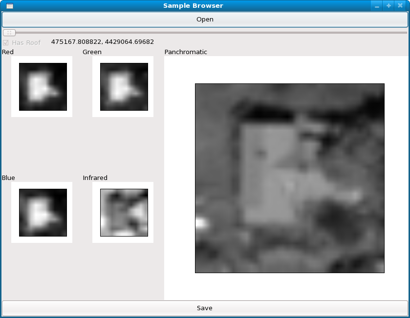
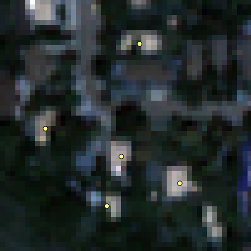
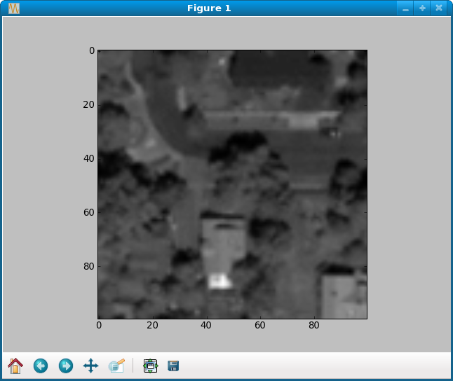
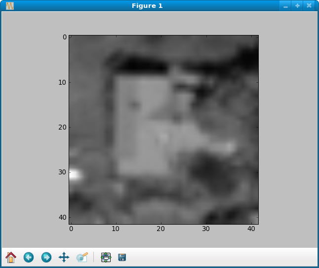

Extract raster windows from satellite imagery with GDAL
=======================================================
Extract and display raster windows from 16-bit satellite imagery using pixel coordinates or geo coordinates.  We first presented this tutorial as part of a three-hour session on `Working with Geographic Information Systems in Python <http://us.pycon.org/2009/tutorials/schedule/1PM4/>`_ during the `2009 Python Conference <http://us.pycon.org/2009/>`_ in Chicago, Illinois.

.. raw:: html

    <object width="425" height="344"><param name="movie" value="http://www.youtube.com/v/9rIdHm0RnGc&hl=en&fs=1&rel=0"></param><param name="allowFullScreen" value="true"></param><param name="allowscriptaccess" value="always"></param><embed src="http://www.youtube.com/v/9rIdHm0RnGc&hl=en&fs=1&rel=0" type="application/x-shockwave-flash" allowscriptaccess="always" allowfullscreen="true" width="425" height="344"></embed></object>

Example
-------------
Make sure all dependencies are installed.
::
    
    yum install gdal gdal-python numpy python-imaging ipython wxPython qgis

Download the :download:`code and data <files/gdal-raster-extract.zip>` and run
the scripts
::

    wget http://invisibleroads.com/tutorials/_downloads/gdal-raster-extract.zip
    unzip gdal-raster-extract.zip
    cd gdal-raster-extract
    cd examples
    python ../extractSamples.py multispectral.tif panchromatic.tif locations.shp
    python ../browseSamples.py

Open the generated SQLite database `samples.db` and browse the extracted samples.
Below you can see the first sample with the four low-resolution multispectral
bands on the left and the high-resolution panchromatic band on the right.

Requirements
-------------
* `Python <http://www.python.org>`_ 
* `Geospatial Data Abstraction Library <http://www.gdal.org>`_
* `Numpy <http://numpy.scipy.org>`_
* `IPython <http://ipython.scipy.org/>`_

To run browseSamples.py, you will also need the following:

* `Python Imaging Library <http://www.pythonware.com/products/pil/>`_
* `wxPython <http://www.wxpython.org/>`_

Walkthrough
-------------
Make sure all dependencies are installed.
::
    
    yum install gdal gdal-python numpy python-imaging ipython wxPython qgis

Download the :download:`code and data <files/gdal-raster-extract.zip>`
and start IPython
::

    wget http://invisibleroads.com/tutorials/_downloads/gdal-raster-extract.zip
    unzip gdal-raster-extract.zip
    cd gdal-raster-extract
    ipython

The package contains two scripts and example data as well as supporting library modules.  
::
    
    In [1]: ls
    browseSamples.py*  examples/  extractSamples.py*  libraries/

    In [2]: ls examples/
    locations.shp  
    locations.shx  
    locations.prj  
    locations.dbf  
    multispectral.tif      
    multispectral.tif.aux.xml
    panchromatic.tif

    In [3]: ls libraries/
    __init__.py 
    image_store.py  
    point_store.py  
    sample_store.py       
    sample_store_lush.py  
    sequence.py       
    store.py
    window_process.py
    view.py

The example data contains a low-resolution multispectral image, 
a high-resolution panchromatic image and several hand-marked locations 
of buildings in the image.  The imagery shows a region of Boulder, Colorado
cropped from DigitalGlobe's sample standard 16-bit imagery.  
Note that for higher geo-referencing accuracy, you would probably use ortho-ready 
imagery instead of the coarsely-orthorectified standard imagery and perform 
orthorectification yourself using a high-resolution digital elevation model (DEM) 
as described in the tutorial :doc:`envi-image-orthorectify`.

Multispectral image with locations

Panchromatic image with locations

.. image:: images/gdal-raster-extract-panchromatic-view.png

.. _gdal-raster-extract-pixel:

Extract raster window from satellite image using a pixel location
^^^^^^^^^^^^^^^^^^^^^^^^^^^^^^^^^^^^^^^^^^^^^^^^^^^^^^^^^^^^^^^^^^
Load panchromatic image
::

    import osgeo.gdal
    imageDataset = osgeo.gdal.Open('examples/panchromatic.tif')

Define methods that we will use later.  Note that we use `pylab.imshow()` 
because PIL's Image class has difficulty handling 16-bit image data.  We want 
to keep the 16-bit values because each raw image bit has potential information 
in remote sensing.
::

    import struct, numpy, pylab

    def extractWindow(pixelX, pixelY, pixelWidth, pixelHeight):
        # Extract raw data
        band = imageDataset.GetRasterBand(1)
        byteString = band.ReadRaster(pixelX, pixelY, pixelWidth, pixelHeight)
        # Convert to a matrix
        valueType = {osgeo.gdal.GDT_Byte: 'B', osgeo.gdal.GDT_UInt16: 'H'}[band.DataType]
        values = struct.unpack('%d%s' % (pixelWidth * pixelHeight, valueType), byteString)
        matrix = numpy.reshape(values, (pixelWidth, pixelHeight))
        # Display matrix
        pylab.imshow(matrix, cmap=pylab.cm.gray)
        pylab.show()
        # Return
        return matrix

    def extractCenteredWindow(pixelX, pixelY, pixelWidth, pixelHeight):
        centeredPixelX = pixelX - pixelWidth / 2
        centeredPixelY = pixelY - pixelHeight / 2
        return extractWindow(centeredPixelX, centeredPixelY, pixelWidth, pixelHeight)

Extract a 100x100 pixel window near the middle of the image
::

    extractCenteredWindow(imageDataset.RasterXSize / 2, imageDataset.RasterYSize / 2, 100, 100)

.. _gdal-raster-extract-geo:

Extract raster window from satellite image using a geo location
^^^^^^^^^^^^^^^^^^^^^^^^^^^^^^^^^^^^^^^^^^^^^^^^^^^^^^^^^^^^^^^
To extract raster windows using geocoordinates, we must convert the geocoordinates to their 
corresponding pixel locations in the image.  Each image has a set of numbers called the 
*GeoTransform* that tell us how to convert between geo locations and pixel locations.

Get image georeferencing information
::

    g0, g1, g2, g3, g4, g5 = imageDataset.GetGeoTransform()

Define conversion methods
::

    def convertGeoLocationToPixelLocation(geoLocation):
        xGeo, yGeo = geoLocation
        if g2 == 0:
            xPixel = (xGeo - g0) / float(g1)
            yPixel = (yGeo - g3 - xPixel*g4) / float(g5)
        else:
            xPixel = (yGeo*g2 - xGeo*g5 + g0*g5 - g2*g3) / float(g2*g4 - g1*g5)
            yPixel = (xGeo - g0 - xPixel*g1) / float(g2)
        return int(round(xPixel)), int(round(yPixel))

    def convertGeoDimensionsToPixelDimensions(geoWidth, geoHeight):
        return int(round(abs(float(geoWidth) / g1))), int(round(abs(float(geoHeight) / g5)))

Load locations from shapefile.  For details, please see the tutorial
:doc:`gdal-shapefile-points-load`.
::

    from libraries import point_store
    geoLocations, spatialReference = point_store.load('examples/locations.shp')

Convert the first geo location to a pixel location
::

    windowPixelX, windowPixelY = convertGeoLocationToPixelLocation(geoLocations[0])

Convert window dimensions from 25 meters to their equivalent in pixels
::

    windowPixelWidth, windowPixelHeight = convertGeoDimensionsToPixelDimensions(25, 25)

Now you can use the method you defined in :ref:`gdal-raster-extract-pixel`.
::

    extractCenteredWindow(windowPixelX, windowPixelY, windowPixelWidth, windowPixelHeight)
    

Code
-------
extractSamples.py
^^^^^^^^^^^^^^^^^
.. literalinclude:: files/gdal-raster-extract/extractSamples.py

browseSamples.py
^^^^^^^^^^^^^^^^
.. literalinclude:: files/gdal-raster-extract/browseSamples.py

window_process.py
^^^^^^^^^^^^^^^^^
.. literalinclude:: files/gdal-raster-extract/libraries/window_process.py

image_store.py
^^^^^^^^^^^^^^
.. literalinclude:: files/gdal-raster-extract/libraries/image_store.py

sample_store.py
^^^^^^^^^^^^^^^
.. literalinclude:: files/gdal-raster-extract/libraries/sample_store.py

sample_store_lush.py
^^^^^^^^^^^^^^^^^^^^
.. literalinclude:: files/gdal-raster-extract/libraries/sample_store_lush.py

point_store.py
^^^^^^^^^^^^^^
.. literalinclude:: files/gdal-raster-extract/libraries/point_store.py

sequence.py
^^^^^^^^^^^
.. literalinclude:: files/gdal-raster-extract/libraries/sequence.py

store.py
^^^^^^^^
.. literalinclude:: files/gdal-raster-extract/libraries/store.py

view.py
^^^^^^^
.. literalinclude:: files/gdal-raster-extract/libraries/view.py
