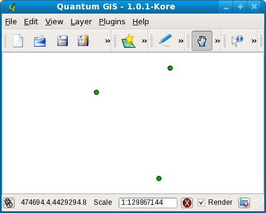

Load points from a shapefile with GDAL
======================================
Load point coordinates and their spatial reference from a shapefile.  We first presented this tutorial as part of a three-hour session on `Working with Geographic Information Systems in Python <http://us.pycon.org/2009/tutorials/schedule/1PM4/>`_ during the `2009 Python Conference <http://us.pycon.org/2009/>`_ in Chicago, Illinois.

.. raw:: html

    <object width="425" height="344"><param name="movie" value="http://www.youtube.com/v/5XkrYU-R4Co?fs=1&amp;hl=en_US&amp;rel=0"></param><param name="allowFullScreen" value="true"></param><param name="allowscriptaccess" value="always"></param><embed src="http://www.youtube.com/v/5XkrYU-R4Co?fs=1&amp;hl=en_US&amp;rel=0" type="application/x-shockwave-flash" allowscriptaccess="always" allowfullscreen="true" width="425" height="344"></embed></object>

Requirements
------------
* `Python <http://python.org>`_ 
* `Geospatial Data Abstraction Library <http://gdal.org>`_

For the walkthrough, you will also need the following:

* `IPython <http://ipython.scipy.org/>`_

Example
-------
Download the :download:`code and data <files/gdal-shapefile-points.zip>`, unzip and start Python.
::

    wget http://invisibleroads.com/tutorials/_downloads/gdal-shapefile-points.zip
    unzip gdal-shapefile-points.zip
    cd gdal-shapefile-points
    python

Load points and spatial reference.
::

    >>> import point_store
    >>> points, spatialReferenceAsProj4 = point_store.load('points.shp')
    >>> points
    [(474592.60011966614, 4429278.1561588384),
     (474577.93537380069, 4429134.3778895922),
     (474496.64167389442, 4429246.2762765223)]
    >>> spatialReferenceAsProj4
    '+proj=longlat +ellps=WGS84 +datum=WGS84 +no_defs '

Walkthrough
-----------
Download the :download:`code and data <files/gdal-shapefile-points.zip>`.
::

    wget http://invisibleroads.com/tutorials/_downloads/gdal-shapefile-points.zip
    unzip gdal-shapefile-points.zip
    cd gdal-shapefile-points

You can peek at the contents of the shapefile using `Quantum GIS <http://qgis.org/>`_.

Open shapefile
^^^^^^^^^^^^^^
Start IPython.
::

    ipython

Import GDAL.
::

    >>> import osgeo.ogr

Make sure we are in the same directory as the shapefile.
::
    
    >>> ls
    points.dbf*  points.prj*  points.shp*  points.shx*  point_store.py*

Open the shapefile.
::

    >>> shapeData = osgeo.ogr.Open('points.shp')
    >>> shapeData
    <osgeo.ogr.DataSource; proxy of <Swig Object of type 'OGRDataSourceShadow *' at 0x88502e8> >

Examine shapefile
^^^^^^^^^^^^^^^^^
Type ``shapeData.`` and press TAB to see what you can do.
::

    >>> shapeData.
    shapeData.CopyLayer            shapeData.Reference            shapeData.__len__
    shapeData.CreateLayer          shapeData.Release              shapeData.__module__
    shapeData.DeleteLayer          shapeData.ReleaseResultSet     shapeData.__new__
    shapeData.Dereference          shapeData.TestCapability       shapeData.__reduce__
    shapeData.Destroy              shapeData.__class__            shapeData.__reduce_ex__
    shapeData.ExecuteSQL           shapeData.__del__              shapeData.__repr__
    shapeData.GetDriver            shapeData.__delattr__          shapeData.__setattr__
    shapeData.GetLayer             shapeData.__dict__             shapeData.__str__
    shapeData.GetLayerByIndex      shapeData.__doc__              shapeData.__swig_destroy__
    shapeData.GetLayerByName       shapeData.__getattr__          shapeData.__swig_getmethods__
    shapeData.GetLayerCount        shapeData.__getattribute__     shapeData.__swig_setmethods__
    shapeData.GetName              shapeData.__getitem__          shapeData.__weakref__
    shapeData.GetRefCount          shapeData.__hash__             shapeData.name
    shapeData.GetSummaryRefCount   shapeData.__init__             shapeData.this

Get the first layer.
::

    >>> layer = shapeData.GetLayer()

Count the number of features in a layer.
::

    >>> layer.GetFeatureCount()
    3

Get the spatial reference of the layer.
::

    >>> spatialReference = layer.GetSpatialRef()
    >>> spatialReference.ExportToProj4()
    '+proj=longlat +ellps=WGS84 +datum=WGS84 +no_defs '

Examine the first point.
::

    >>> feature = layer.GetFeature(0)
    >>> geometry = feature.GetGeometryRef()
    >>> geometry.GetX()
    474592.60011966614
    >>> geometry.GetY()
    4429278.1561588384

Get points
^^^^^^^^^^
Collect points in a list.
::

    shapeData = osgeo.ogr.Open('points.shp')
    layer = shapeData.GetLayer()
    points = []
    for index in xrange(layer.GetFeatureCount()):
        feature = layer.GetFeature(index)
        geometry = feature.GetGeometryRef()
        points.append((geometry.GetX(), geometry.GetY()))

Display points.
::

    >>> points
    [(474592.60011966614, 4429278.1561588384),
     (474577.93537380069, 4429134.3778895922),
     (474496.64167389442, 4429246.2762765223)]

Code
----
.. literalinclude:: files/gdal-shapefile-points/point_store.py
