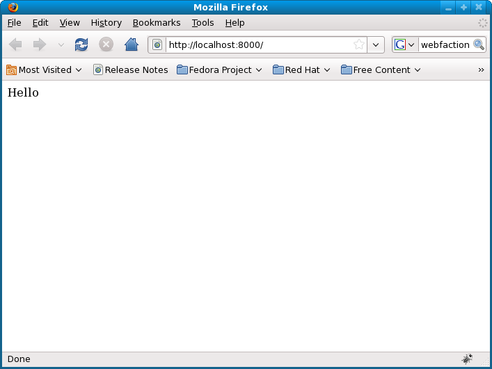
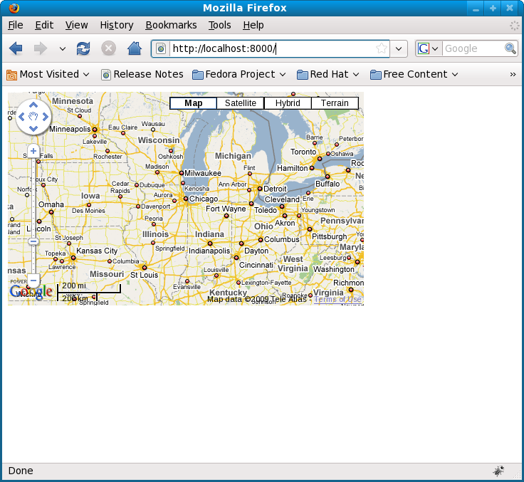
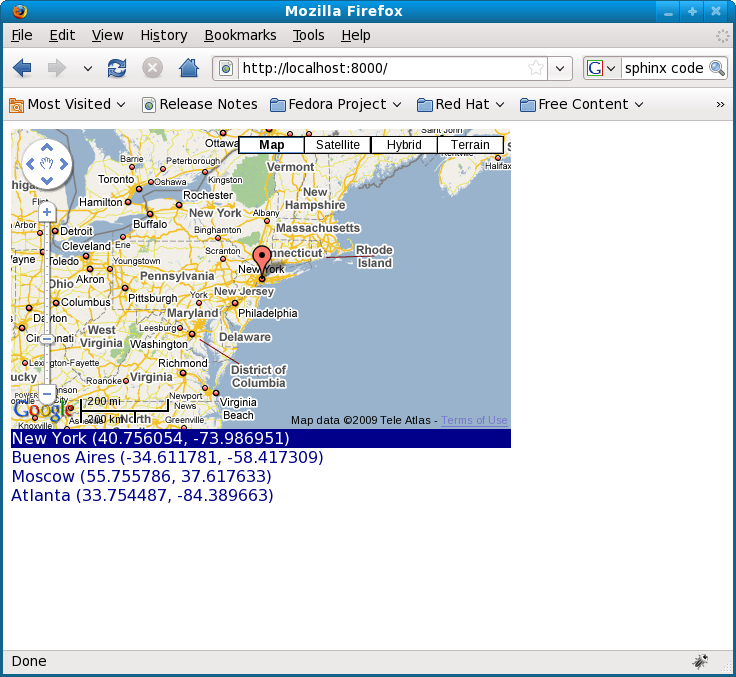
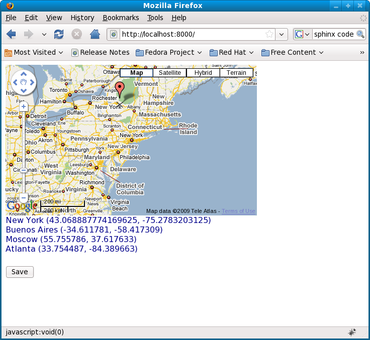
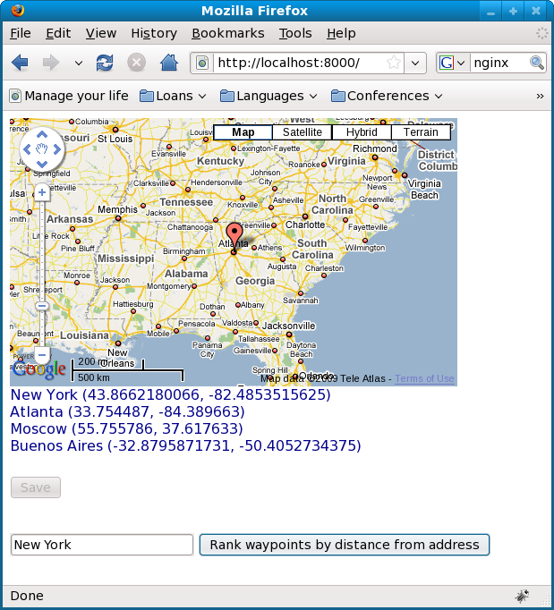
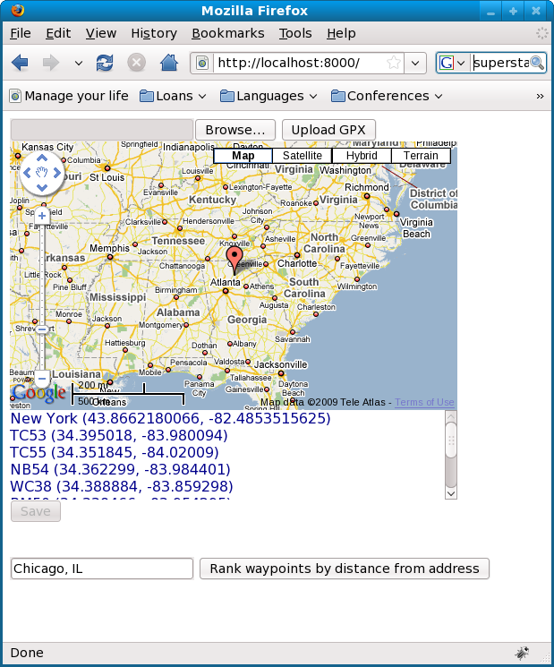

Build a simple GIS web application using GeoDjango and Google Maps
==================================================================
By the end of this tutorial you will have built a simple GIS web application for viewing, editing, searching and uploading GIS data.  We first presented this tutorial as part of a three-hour session on `Working with Geographic Information Systems in Python <http://us.pycon.org/2009/tutorials/schedule/1PM4/>`_ during the `2009 Python Conference <http://us.pycon.org/2009/>`_ in Chicago, Illinois.

.. raw:: html

    <object width="425" height="344"><param name="movie" value="http://www.youtube.com/v/Dfd5lzrz7ps&hl=en&fs=1&rel=0"></param><param name="allowFullScreen" value="true"></param><param name="allowscriptaccess" value="always"></param><embed src="http://www.youtube.com/v/Dfd5lzrz7ps&hl=en&fs=1&rel=0" type="application/x-shockwave-flash" allowscriptaccess="always" allowfullscreen="true" width="425" height="344"></embed></object>

This tutorial has been updated to work with Django 1.3.

Example
-------
Make sure that the latest version of GeoDjango is installed; see :doc:`geodjango-install`.

Start PostgreSQL server.
::
    
    su -c 'service postgresql start'

Create PostgreSQL user and PostGIS database.
::

    createuser -U postgres geouser -S -D -R
    psql -U postgres -c "alter role geouser with password 'geopassword';"
    createdb -U postgres -T template_postgis -O geouser geodatabase

Download the :download:`code and data <files/geodjango-googlemaps.zip>`.
::
    
    wget http://invisibleroads.com/tutorials/_downloads/geodjango-googlemaps.zip
    unzip geodjango-googlemaps.zip
    cd geodjango-googlemaps/googlemaps

Setup tables.
::
    
    python manage.py syncdb

Run server.
::
    
    python manage.py runserver

Go to http://localhost:8000 and experiment with the application.

1. Upload a GPX file of waypoints; a sample GPX file is included in ``geodjango-googlemaps/data``.
2. Click on a waypoint to see its position on the map.
3. Drag a waypoint marker on the map to adjust its position.
4. Save your changes.
5. Enter an address and rank waypoints by distance from address.

Requirements
------------
* `GeoDjango <http://geodjango.org>`_ (see :doc:`geodjango-install`)
* `jQuery <http://jquery.com>`_
* `Firebug <http://getfirebug.com>`_

Walkthrough
-----------
Create spatial database
^^^^^^^^^^^^^^^^^^^^^^^
Create a spatial database using the template from :doc:`postgresql-postgis-install`.
::

    createuser -U postgres geouser -S -D -R
    psql -U postgres -c "alter role geouser with password 'geopassword';"
    createdb -U postgres -T template_postgis -O geouser geodatabase

Create GeoDjango project
^^^^^^^^^^^^^^^^^^^^^^^^
Start a new project and an application.
::

    django-admin.py startproject googlemaps
    cd googlemaps
    python manage.py startapp waypoints

Configure settings
""""""""""""""""""
Add the following lines to the top of ``settings.py``.
::

    # Import system modules
    import os
    # Set paths
    fillPath = lambda x: os.path.join(os.path.dirname(__file__), x)

Change the following parameters in ``settings.py`` as indicated.
::

    DATABASES = {
        'default': {
            'ENGINE' : 'django.contrib.gis.db.backends.postgis',
            'NAME': 'geodatabase',
            'USER': 'geouser',
            'PASSWORD': 'geopassword',
        }
    }
    TEMPLATE_DIRS = (
        fillPath('templates'),
    )
    INSTALLED_APPS = (
        'django.contrib.auth',
        'django.contrib.contenttypes',
        'django.contrib.sessions',
        'django.contrib.sites',
        'django.contrib.messages',
        'django.contrib.staticfiles',
        'django.contrib.admin',
        'django.contrib.admindocs',
        'django.contrib.gis',
        'googlemaps.waypoints',
    )

Create subfolders in the project folder ``googlemaps``.
::
    
    mkdir -p templates/waypoints

Configure models
""""""""""""""""
Edit ``waypoints/models.py``.  The *geometry* attribute contains geospatial information and uses the 4326 spatial reference system that is compatible with the longitude and latitude coordinates provided by the Google Maps API.
::

    # Import django modules
    from django.contrib.gis.db import models

    class Waypoint(models.Model):

        name = models.CharField(max_length=32)
        geometry = models.PointField(srid=4326)
        objects = models.GeoManager()

        def __unicode__(self):
            return '%s %s %s' % (self.name, self.geometry.x, self.geometry.y)

Create tables.
::

    python manage.py syncdb

Configure urls
""""""""""""""
Edit ``urls.py``.  
::

    # Import django modules
    from django.conf.urls.defaults import *
    from django.contrib import admin
    # Import custom modules
    import settings

    admin.autodiscover()
    urlpatterns = patterns('',
        (r'^admin/', include(admin.site.urls)),
        (r'', include('googlemaps.waypoints.urls')),
    )

Create ``waypoints/urls.py`` and add the following code.
::

    # Import django modules
    from django.conf.urls.defaults import *

    urlpatterns = patterns('googlemaps.waypoints.views',
        url(r'^$', 'index', name='waypoints-index'),
    )

Edit ``waypoints/views.py`` and add the following code.
::
    
    from django.http import HttpResponse

    def index(request):
        return HttpResponse('Hello')

Test
""""
Run development server.
::

    python manage.py runserver

Go to http://localhost:8000 in your browser.

View map
^^^^^^^^
Create url
""""""""""
Make sure that ``waypoints/urls.py`` has an index.
::

    # Import django modules
    from django.conf.urls.defaults import *

    urlpatterns = patterns('googlemaps.waypoints.views',
        url(r'^$', 'index', name='waypoints-index'),
    )

Create template
"""""""""""""""
Create the template ``templates/waypoints/index.html``.
::

    <!doctype html>
    <html>
    <head>
    <meta name="viewport" content="initial-scale=1.0, user-scalable=no" />
    
    
    
    </head>
    <body onload='initialize()'>
        

    </body>
    </html>

Create view
"""""""""""
Edit ``waypoints/views.py``.
::

    from django.shortcuts import render_to_response
    
    def index(request):
        'Display map'
        return render_to_response('waypoints/index.html', {
        })

Test
""""
Run development server.
::

    python manage.py runserver

Go to http://localhost:8000

View waypoints
^^^^^^^^^^^^^^
Modify template
"""""""""""""""
Add a script link to the `jQuery <http://jquery.com>`_ library below the script link to the Google Maps API in ``templates/waypoints/index.html``.
::

    
    

Add Javascript code for displaying waypoint markers.
::

    

Add styles for the waypoint content box.
::

    

Finally, add the waypoint content box in the body.
::

    <body onload='initialize()'>
        

        

            {{content}}
        

    </body>

Your ``templates/waypoints/index.html`` template should resemble the following.
::

    <!doctype html>
    <html>
    <head>
    <meta name="viewport" content="initial-scale=1.0, user-scalable=no" />
    
    
    
    
    </head>
    <body onload='initialize()'>
        

        

            {{content}}
        

    </body>
    </html>

Create another template for displaying waypoint content in ``templates/waypoints/waypoints.html``.
::

    
        

            {{waypoint.name}} ({{waypoint.geometry.y}}, {{waypoint.geometry.x}})
        

    

Modify view
"""""""""""
Modify *index* in ``waypoints/views.py``.
::

    # Import django modules
    from django.shortcuts import render_to_response
    from django.template.loader import render_to_string
    # Import custom modules
    from googlemaps.waypoints.models import Waypoint

    def index(request):
        'Display map'
        waypoints = Waypoint.objects.order_by('name')
        return render_to_response('waypoints/index.html', {
            'waypoints': waypoints,
            'content': render_to_string('waypoints/waypoints.html', {'waypoints': waypoints}),
        })

Test
""""
Create data.
::
    
    python manage.py shell
        from waypoints.models import Waypoint
        Waypoint(name='New York', geometry='POINT(-73.9869510 40.7560540)').save()
        Waypoint(name='Buenos Aires', geometry='POINT(-58.4173090 -34.6117810)').save()
        Waypoint(name='Moscow', geometry='POINT(37.6176330 55.7557860)').save()
        Waypoint(name='Atlanta', geometry='POINT(-84.3896630 33.7544870)').save()
        print Waypoint.objects.all()

Run development server.
::

    python manage.py runserver

Go to http://localhost:8000 and click on a waypoint in the content box

Edit waypoints
^^^^^^^^^^^^^^
Create url
""""""""""
Add *save* to ``waypoints/urls.py``.
::

    # Import django modules
    from django.conf.urls.defaults import *

    urlpatterns = patterns('googlemaps.waypoints.views',
        url(r'^$', 'index', name='waypoints-index'),
        url(r'^save$', 'save', name='waypoints-save'),
    )

Modify template
"""""""""""""""
Update jQuery's ``$(document).ready()`` construct in ``templates/waypoints/index.html``.
::

    var currentObject;

    $(document).ready(function () {
        function activateWaypoints() {
            // Add waypoint click handler
            $('.waypoint').each(function () {
                $(this).click(function() {
                    var waypoint = waypointByID[this.id];
                    var center = new google.maps.LatLng(waypoint.lat, waypoint.lng);
                    currentObject = $(this);
                    if (marker) marker.setMap();
                    marker = new google.maps.Marker({map: map, position: center, draggable: true});
                    google.maps.event.addListener(marker, 'dragend', function() {
                        var position = marker.getPosition();
                        waypoint.lat = position.lat();
                        waypoint.lng = position.lng();
                        currentObject.html(waypoint.name + 
                            ' (' + waypoint.lat + 
                            ', ' + waypoint.lng + ')');
                        $('#saveWaypoints').removeAttr('disabled');
                    });
                    map.panTo(center);
                }).hover(
                    function () {this.className = this.className.replace('OFF', 'ON');}, 
                    function () {this.className = this.className.replace('ON', 'OFF');}
                );
            });
        }
        $('#saveWaypoints').click(function () {
            var waypointStrings = [];
            for (id in waypointByID) {
                waypoint = waypointByID[id];
                waypointStrings.push(id + ' ' + waypoint.lng + ' ' + waypoint.lat);
            };
            $.post("", {
                waypointsPayload: waypointStrings.join('\n')
            }, function (data) {
                if (data.isOk) {
                    $('#saveWaypoints').attr('disabled', 'disabled');
                } else {
                    alert(data.message);
                }
            });
        });
        activateWaypoints();
    });

Add a button to the body.
::

    <body onload='initialize()'>
        

        

            {{content}}
        

        <input id=saveWaypoints type=button value=Save disabled=disabled>
    </body>

Create view
"""""""""""
Add *save* to ``waypoints/views.py``.
::

    # Import django modules
    from django.http import HttpResponse
    # Import system modules
    import simplejson
    # Import custom modules
    from googlemaps.waypoints.models import Waypoint

    def save(request):
        'Save waypoints'
        for waypointString in request.POST.get('waypointsPayload', '').splitlines():
            waypointID, waypointX, waypointY = waypointString.split()
            waypoint = Waypoint.objects.get(id=int(waypointID))
            waypoint.geometry.set_x(float(waypointX))
            waypoint.geometry.set_y(float(waypointY))
            waypoint.save()
        return HttpResponse(simplejson.dumps(dict(isOk=1)), mimetype='application/json')

Test
""""
Run development server.
::

    python manage.py runserver

Go to http://localhost:8000, drag a waypoint to a new location and click *Save*.  Refresh the page to verify that changes were saved.

Rank waypoints by distance from address
^^^^^^^^^^^^^^^^^^^^^^^^^^^^^^^^^^^^^^^
Create url
""""""""""
Add *search* to ``waypoints/urls.py``.
::

    # Import django modules
    from django.conf.urls.defaults import *

    urlpatterns = patterns('googlemaps.waypoints.views',
        url(r'^$', 'index', name='waypoints-index'),
        url(r'^save$', 'save', name='waypoints-save'),
        url(r'^search$', 'search', name='waypoints-search'),
    )

Modify template
"""""""""""""""
Add a geocoder to ``templates/waypoints/index.html``.
::

    var map;
    var geocoder;
        
    function initialize() {
        map = new google.maps.Map(document.getElementById('map'), {
            zoom: 5,
            center: new google.maps.LatLng(41.879535, -87.624333),
            mapTypeId: google.maps.MapTypeId.ROADMAP
        });
        geocoder = new google.maps.Geocoder();
    }

Insert the following code within jQuery's ``$(document).ready()`` construct.
::

    function searchWaypoints() {
        geocoder.geocode({
            'address': $('#address').val()
        }, function(results, status) {
            if (status == google.maps.GeocoderStatus.OK) {
                var position = results[0].geometry.location;
                $.get("", {
                    lat: position.lat(), 
                    lng: position.lng()
                }, function (data) {
                    if (data.isOk) {
                        $('#waypoints').html(data.content);
                        waypointByID = data.waypointByID;
                        activateWaypoints();
                    } else {
                        alert(data.message);
                    }
                }, 'json');
            } else {
                alert('Could not find geocoordinates for the following reason: ' + status);
            }
        });
    }
    $('#searchWaypoints').click(searchWaypoints);
    $('#address').keydown(function(e) {
        if (e.keyCode == 13) searchWaypoints();
    });

Add a *search* button to the body after the *save* button.
::

    <body onload='initialize()'>
        

        

            {{content}}
        

        <input id=saveWaypoints type=button value=Save disabled=disabled>
         
         
         
        <input id=address value='Chicago, IL'> 
        <input id=searchWaypoints type=button value='Rank waypoints by distance from address'>
    </body>

Create view
"""""""""""
Add *search* to ``waypoints/views.py``.
::

    # Import django modules
    from django.contrib.gis.geos import Point
    # Import system modules
    import simplejson

    def search(request):
        'Search waypoints'
        # Build searchPoint
        try:
            searchPoint = Point(float(request.GET.get('lng')), float(request.GET.get('lat')))
        except:
            return HttpResponse(simplejson.dumps(dict(isOk=0, message='Could not parse search point')))
        # Search database
        waypoints = Waypoint.objects.distance(searchPoint).order_by('distance')
        # Return
        return HttpResponse(simplejson.dumps(dict(
            isOk=1,
            content=render_to_string('waypoints/waypoints.html', {
                'waypoints': waypoints
            }),
            waypointByID=dict((x.id, {
                'name': x.name,
                'lat': x.geometry.y, 
                'lng': x.geometry.x,
            }) for x in waypoints),
        )), mimetype='application/json')

Test
""""
Run development server.
::

    python manage.py runserver

Go to http://localhost:8000, type an address and rank by distance from address.

Upload waypoints from GPX file
^^^^^^^^^^^^^^^^^^^^^^^^^^^^^^
Create url
""""""""""
Add *upload* to ``waypoints/urls.py``.
::

    # Import django modules
    from django.conf.urls.defaults import *

    urlpatterns = patterns('googlemaps.waypoints.views',
        url(r'^$', 'index', name='waypoints-index'),
        url(r'^save$', 'save', name='waypoints-save'),
        url(r'^search$', 'search', name='waypoints-search'),
        url(r'^upload$', 'upload', name='waypoints-upload'),
    )

Create template
"""""""""""""""
Add the *upload* form above the map in ``templates/waypoints/index.html``.  The ``csrf_token`` is required by Django for security reasons; see `Cross Site Request Forgery Protection <http://docs.djangoproject.com/en/dev/ref/contrib/csrf>`_.
::

    <form enctype="multipart/form-data" method=post action="">
        
        <input type=file name=gpx>
        <input type=submit value='Upload GPX'>
    </form>

Create view
"""""""""""
Modify *index* view to specify ``RequestContext`` and add *upload* view in ``waypoints/views.py``.  The ``RequestContext`` is required by Django for security reasons; see `Cross Site Request Forgery Protection <http://docs.djangoproject.com/en/dev/ref/contrib/csrf>`_.
::
    
    # Import django modules
    from django.http import HttpResponseRedirect
    from django.template import RequestContext
    from django.contrib.gis.gdal import DataSource
    from django.core.urlresolvers import reverse
    # Import system modules
    import itertools
    import tempfile
    import os
    # Import custom modules
    from googlemaps.waypoints.models import Waypoint
    from googlemaps import settings

    def index(request):
        'Display map'
        waypoints = Waypoint.objects.order_by('name')
        return render_to_response('waypoints/index.html', {
            'waypoints': waypoints,
            'content': render_to_string('waypoints/waypoints.html', {'waypoints': waypoints}),
        }, context_instance=RequestContext(request))

    def upload(request):
        'Upload waypoints'
        # If the form contains an upload,
        if 'gpx' in request.FILES:
            # Get
            gpxFile = request.FILES['gpx']
            # Save
            targetPath = tempfile.mkstemp()[1]
            destination = open(targetPath, 'wt')
            for chunk in gpxFile.chunks(): 
                destination.write(chunk)
            destination.close()
            # Parse
            dataSource = DataSource(targetPath)
            layer = dataSource[0]
            waypointNames = layer.get_fields('name')
            waypointGeometries = layer.get_geoms()
            for waypointName, waypointGeometry in itertools.izip(waypointNames, waypointGeometries):
                waypoint = Waypoint(name=waypointName, geometry=waypointGeometry.wkt)
                waypoint.save()
            # Clean up
            os.remove(targetPath)
        # Redirect
        return HttpResponseRedirect(reverse('waypoints-index'))

Test
""""
Run development server.
::

    python manage.py runserver

Go to http://localhost:8000 and upload a GPX file such as the `New Zealand Tourist Waypoints <http://www.esnips.com/web/GPSStuff>`_.

Troubleshooting
---------------
Google Maps
^^^^^^^^^^^
Google Maps hangs
"""""""""""""""""
Google Maps occasionally hangs after a redirect when Firebug is enabled.  Disabling Firebug or restarting your browser will resolve this problem.

Google Maps API server rejected your request
""""""""""""""""""""""""""""""""""""""""""""
Google Maps may indicate that your request is invalid.  Make sure that you have replaced the value of the *sensor* parameter to either *true* or *false*. 

Incorrect
::

    

Correct
::

    
