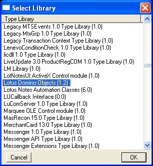
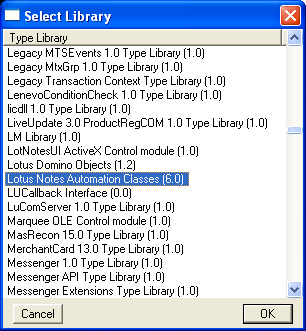
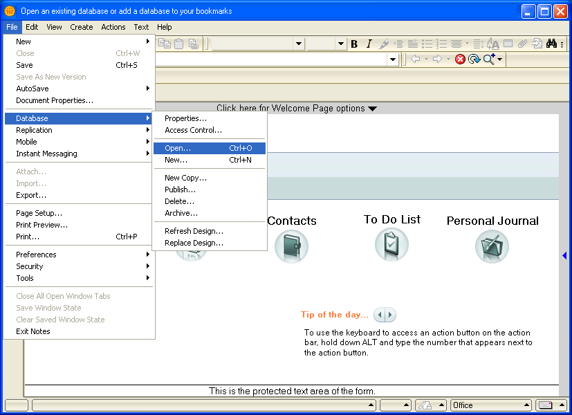
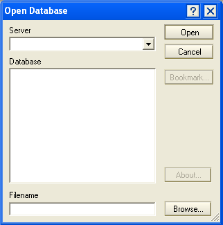

Read mail using the Lotus Notes COM interface
=============================================
Here you will read mail in Lotus Notes using a combination of Mark Hammond's `Python for Windows extensions <http://sourceforge.net/projects/pywin32>`_ and LotusScript.  We first presented this screencast as part of a three-hour session on `Automating Windows Applications using win32com <http://us.pycon.org/2008/tutorials/AutomatingWindows>`_ during the `2008 Python Conference <http://us.pycon.org/2008>`_ in Chicago, Illinois.

Requirements
------------
* `Lotus Notes <http://ibm.com/software/lotus>`_
* `Python <http://python.org>`_
* `Python for Windows extensions <http://sourceforge.net/projects/pywin32>`_

Walkthrough
-----------
Generate type libraries
^^^^^^^^^^^^^^^^^^^^^^^
To expose the COM interface of Lotus Notes in Python, you should generate the type libraries.
::

    from win32com.client import makepy
    makepy.GenerateFromTypeLibSpec('Lotus Domino Objects')
    makepy.GenerateFromTypeLibSpec('Lotus Notes Automation Classes')

Generating type libraries reveals the application's COM objects to Python's inspection methods and empowers IPython's autocompletion feature.
::

    from win32com.client import Dispatch
    notesSession = Dispatch('Lotus.NotesSession')

    dir(notesSession)
    notesSession.         # IPython only (press period and TAB to see member variables and methods)
    notesSession?         # IPython only (see arguments and documentation)
    notesSession??        # IPython only (see source code)

    from win32com.client import constants
    dir(constants)

If you do not know the name of your application's type library, you can run ``makepy`` manually.  You can find ``makepy.py`` in the ``Lib\site-packages\win32com\client`` subdirectory of your Python installation.
::

   C:\Python26\Lib\site-packages\win32com\client\makepy.py
    
Run ``makepy.py`` and select ``Lotus Domino Objects``

Run ``makepy.py`` and select ``Lotus Notes Automation Classes``

You can find documentation on the Lotus Notes COM interface by searching the internet for ``LotusScript``.

.. _notes-mail-read-win32com-domino:

Find location of Domino mailbox
^^^^^^^^^^^^^^^^^^^^^^^^^^^^^^^
To access your mail through Lotus Notes, you will need to know the name of the Domino server and the location of your Domino mailbox.

In Lotus Notes, choose ``File > Database > Open`` from the menu.

Look for the Domino server name in the Server drop down box, then click on the Domino mailbox in the directory tree.  The path of your Domino mailbox should appear in the ``Filename`` input box.

Connect to Domino mailbox
^^^^^^^^^^^^^^^^^^^^^^^^^
Use your credentials to connect to the Domino server using win32com.  For the ``mailPath`` variable, specify the path of your Domino mailbox as described in :ref:`notes-mail-read-win32com-domino`.
::

    # Import system modules
    import win32com.client
    import pywintypes
    import getpass

    # Get credentials
    mailServer = raw_input('Server: ')
    mailPath = raw_input('Mailbox: ')
    mailPassword = getpass.getpass()
    # Connect
    notesSession = win32com.client.Dispatch('Lotus.NotesSession')
    try:
        notesSession.Initialize(mailPassword)
        notesDatabase = notesSession.GetDatabase(mailServer, mailPath)
    except pywintypes.com_error: 
        raise Exception('Cannot access mail using %s on %s' % (mailPath, mailServer))

Browse folders
^^^^^^^^^^^^^^
In Lotus Notes, the mailbox folders are a subset of the views in the database.
::

    # Get a list of folders
    for view in notesDatabase.Views:
        if view.IsFolder:
            print view.Name

You may recognize some of your mailbox folders.  Standard folders have special names such as ``($Inbox)`` and ``($Trash)``.

Load message
^^^^^^^^^^^^
The COM interface has an iterator for cycling through the messages in a folder.  We'll wrap the iterator in a generator.
::

    def makeDocumentGenerator(folderName):
        # Get folder
        folder = notesDatabase.GetView(folderName)
        if not folder:
            raise Exception('Folder "%s" not found' % folderName)
        # Get the first document
        document = folder.GetFirstDocument()
        # If the document exists,
        while document:
            # Yield it
            yield document
            # Get the next document
            document = folder.GetNextDocument(document)

Display the subject for each message in the inbox.
::

    for document in makeDocumentGenerator('($Inbox)'):
        print document.GetItemValue('Subject')[0].strip()

We can retrieve the other fields in a similar fashion.
::

    # Import system modules
    import datetime

    # Get fields
    subject = document.GetItemValue('Subject')[0].strip()
    date = datetime.datetime.fromtimestamp(int(document.GetItemValue('PostedDate')[0]))
    fromWhom = document.GetItemValue('From')[0].strip()
    toWhoms = document.GetItemValue('SendTo')
    body = document.GetItemValue('Body')[0].strip()

Load attachments
^^^^^^^^^^^^^^^^
Define a function for reserving a temporary file.
::

    # Import system modules
    import os
    import tempfile

    def getTemporaryPath():
        temporaryIndex, temporaryPath = tempfile.mkstemp()
        os.close(temporaryIndex)
        return temporaryPath

Define a function for extracting attachments from a document.
::
    
    # Given a document, return a list of attachment filenames and their contents
    def extractAttachments(document):
        # Prepare
        attachmentPacks = []
        # For each item,
        for whichItem in xrange(len(document.Items)):
            # Get item
            item = document.Items[whichItem]
            # If the item is an attachment,
            if item.Name == '$FILE':
                # Prepare
                attachmentPath = getTemporaryPath()
                # Get the attachment
                fileName = item.Values[0]
                fileBase, separator, fileExtension = fileName.rpartition('.')
                attachment = document.GetAttachment(fileName)
                attachment.ExtractFile(attachmentPath)
                attachmentContent = open(attachmentPath, 'rb').read()
                os.remove(attachmentPath)
                # Append
                attachmentPacks.append((fileBase, fileExtension, attachmentContent))
        # Return
        return attachmentPacks

Run the function on a sample document.
::

    attachmentPacks = extractAttachments(document)

Display the number of attachments for each message in the inbox.
::

    for document in makeDocumentGenerator('($Inbox)'):
        print len(extractAttachments(document))
