Manage your goals
=================
`InvisibleRoads <http://invisibleroads.com>`_ provides a way to remember what you need to do, wherever you are.

Browse goals
------------
When you first navigate to `InvisibleRoads <http://invisibleroads.com>`_, you will see three lists of goals as well as a toolbar of buttons at the top, including a dropdown box of tags.  When you are not logged in, the only goals and tags you see are those corresponding to tags that users have explicitly made public.

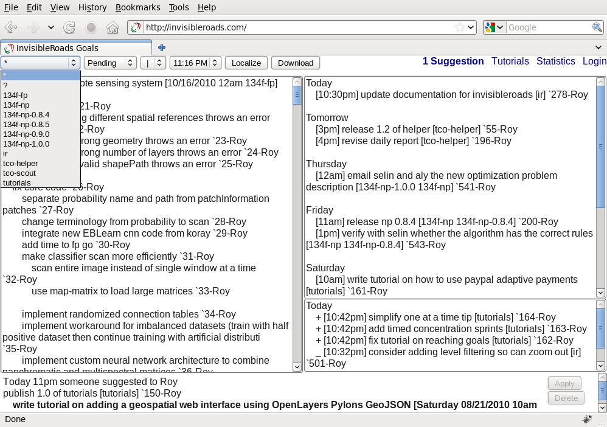

Browse goals by hierarchy
^^^^^^^^^^^^^^^^^^^^^^^^^
Goals on the left are grouped by hierarchy, where subgoals are indented underneath their parent goal. ::

    list goal one
        list subgoal one one
        list subgoal one two

    list goal two
        list subgoal two one
            list subgoal two one one

Browse goals by date
^^^^^^^^^^^^^^^^^^^^
Goals on the right are grouped by date, where scheduled goals are indented underneath their corresponding date. ::

    Tomorrow
        list first scheduled goal

    07/04/2010
        list second scheduled goal

When browsing pending goals, you will also see recently completed and cancelled goals on the bottom right.

Browse goals by scope
^^^^^^^^^^^^^^^^^^^^^
If you are logged in, an extra dropdown box appears on the toolbar.  Selecting a scope from the dropdown box will update the page to show goals that have a scope narrower or equal to the chosen scope.

- Owned scope shows goals for which you are the owner.
- Shared scope shows owned goals plus goals whose tags have been explicitly shared with you.
- Public scope shows owned and shared goals plus goals whose tags have been made public.

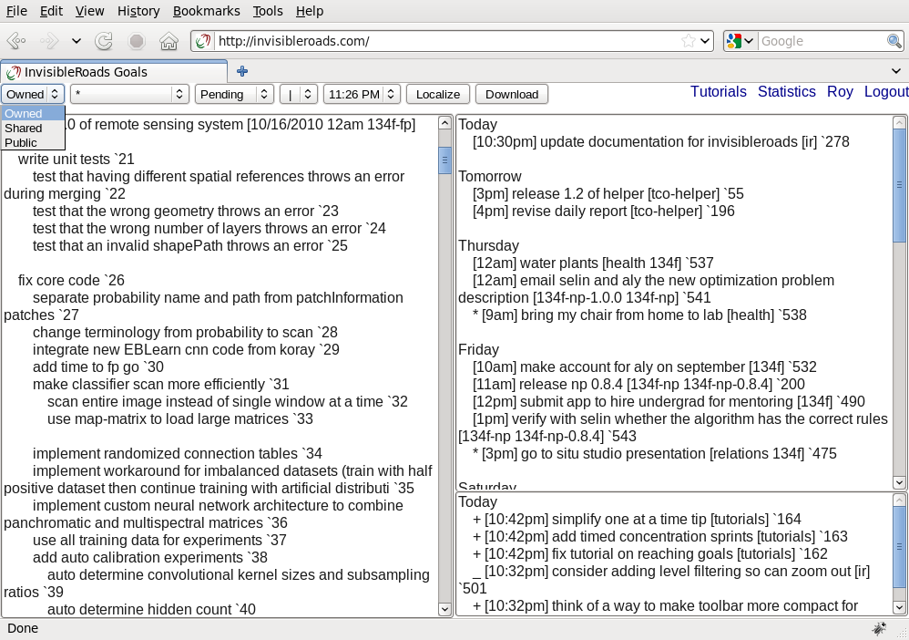

Browse goals by tag
^^^^^^^^^^^^^^^^^^^
Selecting a tag from the dropdown box will update the page to show goals relevant to that tag.  The asterisk (*) will show all goals regardless of tag and the question mark (?) will show goals that are missing tags.

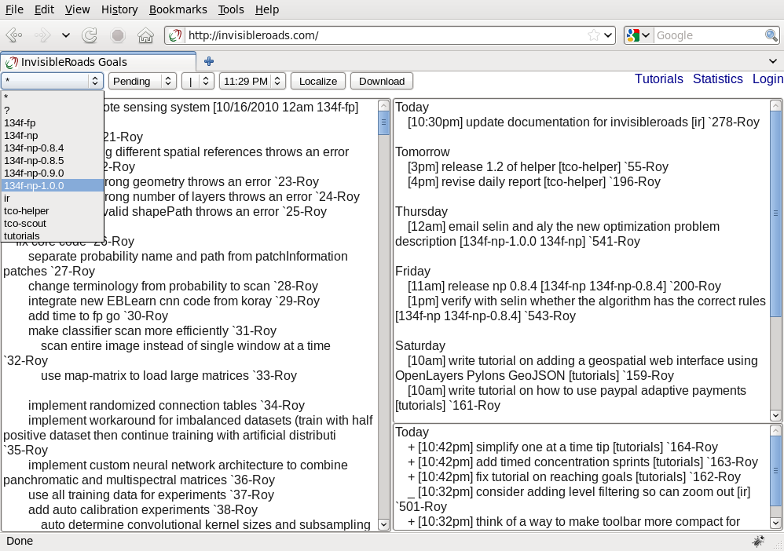

Browse goals by status
^^^^^^^^^^^^^^^^^^^^^^
Selecting a status from the dropdown box will update the page to show goals with the chosen status.

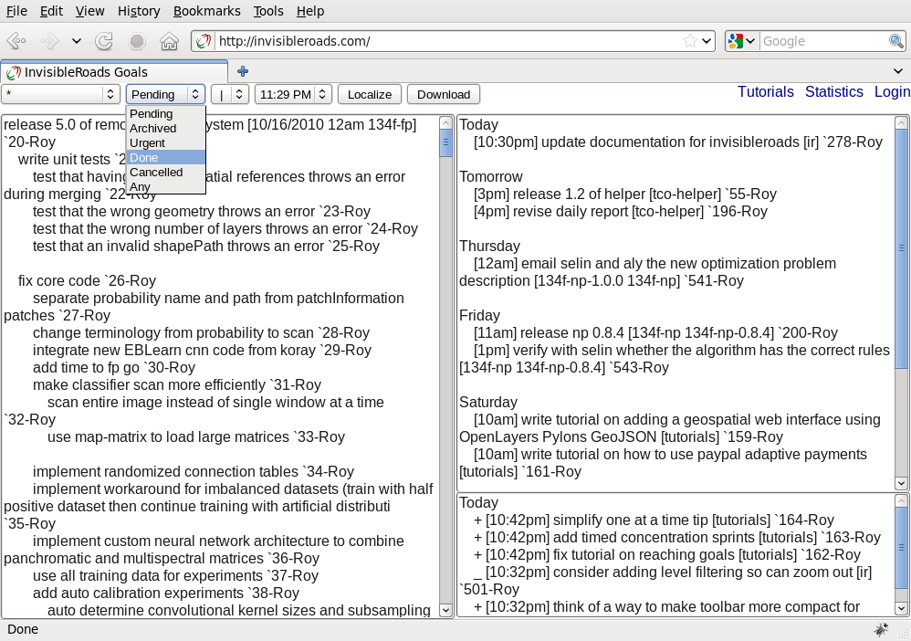

Adjust layout
^^^^^^^^^^^^^
Selecting a layout from the dropdown box will rearrange the placement of the goal lists to a horizontal or vertical stack.

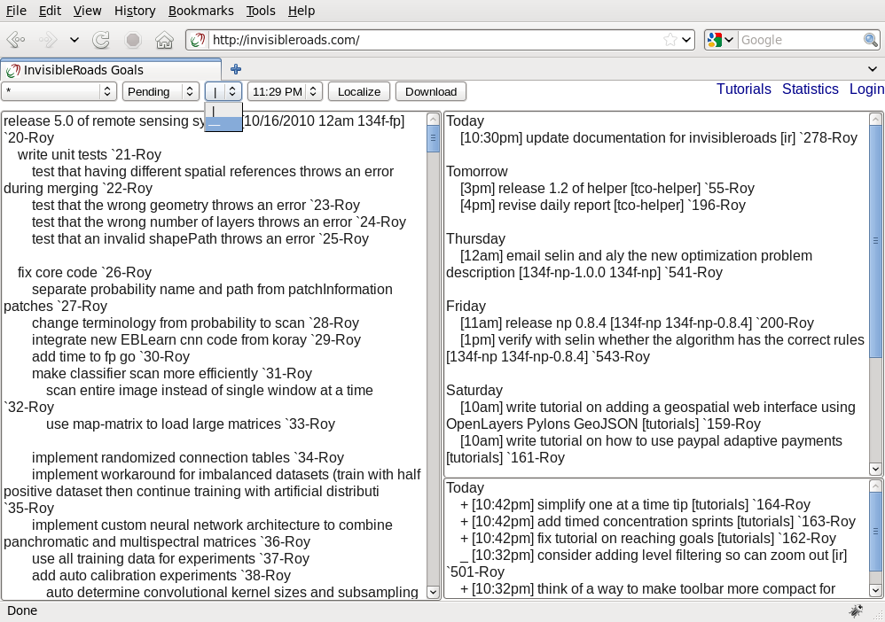

Change timezone
^^^^^^^^^^^^^^^
To display scheduled dates in a different timezone, choose the time corresponding to your local time from the dropdown box.  To reset the display to your browser's local time, press the Localize button.

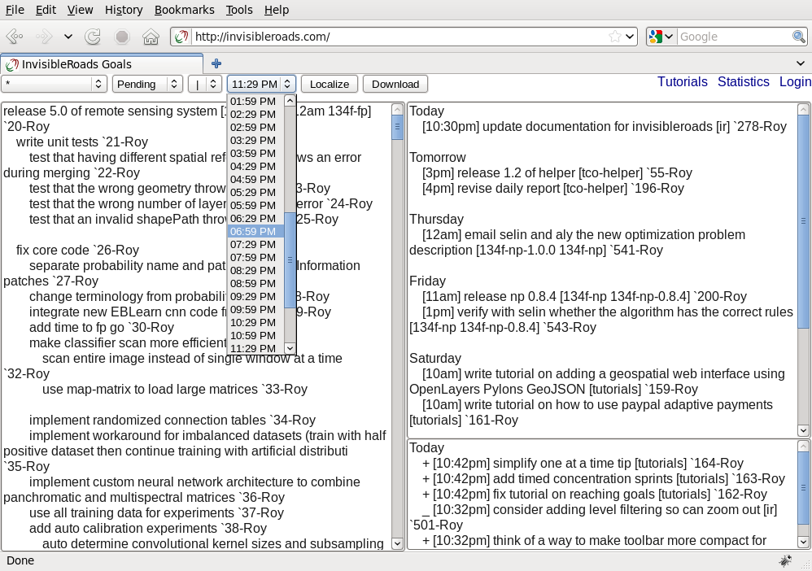

Download goals and tags
^^^^^^^^^^^^^^^^^^^^^^^
Press the Download button to save the currently displayed goals and tags as a text file.

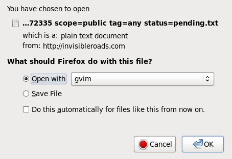

View goal statistics
--------------------
To see goal statistics by person and by tag, click the Statistics link.  Note that these statistics are computed only for tags that you have permission to see, i.e. if you are not logged in, you will only see statistics for public tags.  Click on a tag to manage its goals.

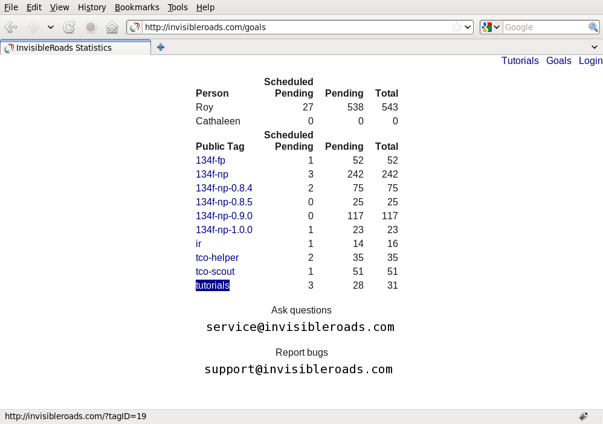

Suggest changes to goals
------------------------
When you edit or add subgoals to goals that you see but which you do not have permission to change, those goals are saved as suggestions.  This means that you can edit another person's goals or edit goals without logging in, and have your edits recorded without changing the original.

You can also change the nickname at the end of a goal to suggest a transfer of ownership.  For example, you can request ownership of a goal by changing the nickname at the end of a goal to your nickname.  Similarly, you can also suggest that another person take ownership of a goal.

Only the original goal owner can apply the suggestion, which changes the original goal to match the suggestion.  Both the original goal owner and suggestion sender can delete the suggestion.

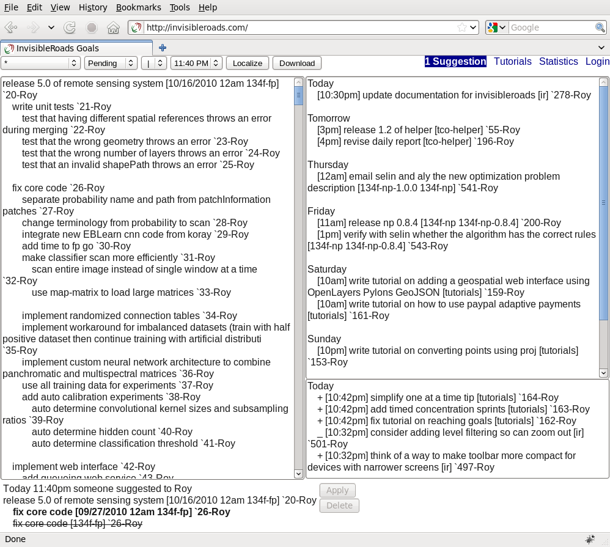

Manage your account
-------------------
- To login, click Login.
- To register, go to the Login page and click Register for an account.  Click the link in the confirmation email.
- To reset your password, go to the Login page and click Forgot your password.  Click the link in the confirmation email.
- To update your account, click on your nickname while logged in.  Click the link in the confirmation email.
- To logout, click Logout.

Manage goals
------------
You need to be logged in to edit goals, otherwise your changes will be saved as suggestions.  Changes to your goals are saved whenever you switch focus to the other textarea (by clicking on the other textarea) or when you move to another page or logout.

Add subgoal to goal
^^^^^^^^^^^^^^^^^^^
Indent subgoals directly beneath the parent goal.  Press Tab to indent a goal or selection.  Press Shift-Tab to unindent a goal or selection. ::

    list goal one
        list subgoal one one
        list subgoal one two

Schedule a goal
^^^^^^^^^^^^^^^
Schedule goals by specifying a date and/or time between square brackets. ::

    schedule relative date
        schedule goal [tod]
        schedule goal [today]
        schedule goal [tom]
        schedule goal [tomorrow]
        schedule goal [yes]
        schedule goal [yesterday]

    schedule relative date by weekday, e.g. next monday
        schedule goal [mon]
        schedule goal [monday]
        schedule goal [tue]
        schedule goal [tuesday]
        schedule goal [wed]
        schedule goal [wednesday]
        schedule goal [thu]
        schedule goal [thursday]
        schedule goal [fri]
        schedule goal [friday]

    schedule absolute date
        schedule goal [7/4]
        schedule goal [7/4/2010]

    specify time, assuming the date is today
        schedule goal [1pm]
        schedule goal [1:30pm]

    specify date and time
        schedule goal [tod 1pm]
        schedule goal [today 1pm]
        schedule goal [mon 1pm]
        schedule goal [monday 1pm]
        schedule goal [7/4 1pm]
        schedule goal [7/4/2010 1pm]

Mark a goal complete, urgent or cancelled
^^^^^^^^^^^^^^^^^^^^^^^^^^^^^^^^^^^^^^^^^
Set the status of a goal by prepending the goal with one of the following symbols. ::
    
    Mark a goal pending (no prepended symbol)
    * Mark a goal done
    + Mark a goal done
    _ Mark a goal cancelled

Edit goals by hierarchy or date
^^^^^^^^^^^^^^^^^^^^^^^^^^^^^^^
To edit goals by hierarchy, make your changes to the textarea on the left (in horizontal layout) or on the top (in vertical layout).  Subgoals are indented beneath their parent goal.

To edit goals by date, make your changes to the textarea on the right (in horizontal layout) or on the bottom (in vertical layout).  Rearrange a goal to a different or new date to reschedule it.  

Click a different textarea to save your changes.

Tag a goal
^^^^^^^^^^
Tags are a flexible way to group goals into categories.  Specify tags for a goal using square brackets.  Separate multiple tags with spaces. ::

    tag a goal [tag1 tag2 tag3]     

Rename a tag
^^^^^^^^^^^^
Select the tag from the dropdown box to view goals associated with the tag.  Next to the dropdown box, there will be an input box containing the tag text.  

Change the name of the tag and click outside the input box to save your changes.  Do not include spaces in the name of the tag.

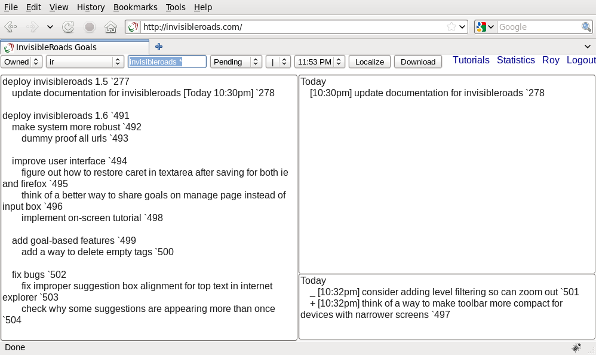

Share a tag and its associated goals with another user or the public
^^^^^^^^^^^^^^^^^^^^^^^^^^^^^^^^^^^^^^^^^^^^^^^^^^^^^^^^^^^^^^^^^^^^
Select the tag from the dropdown box to view goals associated with the tag.  Next to the dropdown box, there will be an input box containing the tag text.  

After the tag text, type the nicknames of users with whom you want to share the tag and its associated goals.  Separate multiple nicknames with spaces. ::

    tag Roy Cathaleen

Use an asterisk to share a tag and its associated goals with the public. ::

    tag *

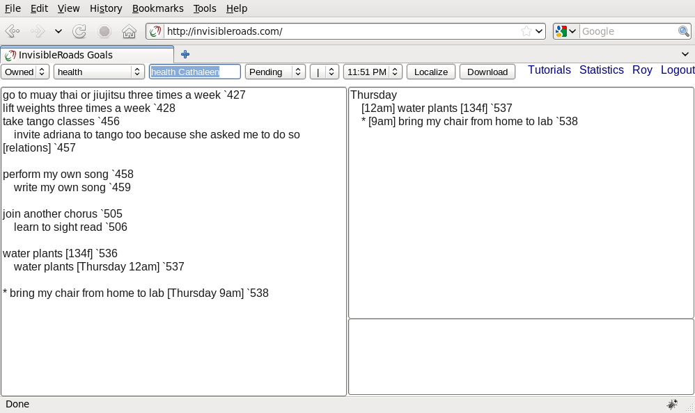

Send text message alerts for urgent scheduled goals
^^^^^^^^^^^^^^^^^^^^^^^^^^^^^^^^^^^^^^^^^^^^^^^^^^^
If you marked a scheduled goal as urgent and if you provided an `SMS address <http://en.wikipedia.org/wiki/List_of_SMS_gateways>`_ for your cell phone, then you will receive the goal at the scheduled time as a text message on your cell phone. ::

    * buy groceries [Today 6pm]

Edit goal via text message
^^^^^^^^^^^^^^^^^^^^^^^^^^
You can add a goal by sending a text message.  The server will send a confirmation, which you can edit and send back to update the goal.

Edit goals via email
^^^^^^^^^^^^^^^^^^^^
If you have scheduled pending goals, then you will receive a daily email listing your pending goals.  You may respond to this email with your edits and the changes will saved in the database.

See features
------------
Here is the complete feature list.

* Browse goals

  * Show public tags and goals when not logged in
  * Sort by hierarchy
  * Sort by date
  * Filter by scope when logged in
  * Filter by tag
  * Filter by status
  * Adjust layout
  * Change timezone
  * Download goals and tags

* View goal statistics
    
  * View goal statistics by tag
  * View goal statistics by person

* Suggest changes to goals you can see

  * Add suggestion to add when adding goal while anonymous
  * Add suggestion to add when adding goal to inaccessible goal while anonymous
  * Add suggestion to add when adding goal to shared goal while logged in
  * Add suggestion to add when editing inaccessible goal while anonymous
  * Add suggestion to add when editing inaccessible goal while logged in
  * Add suggestion to edit when editing public goal while anonymous
  * Add suggestion to edit when editing shared goal while logged in
  * Apply suggestion if owner is logged in
  * Delete suggestion if owner or suggester is logged in

* Manage account

  * Login
  * Register account
  * Reset password
  * Update account
  * Logout

* Manage goals when logged in

  * Add subgoal to goal
  * Schedule a goal
  * Mark a goal complete, urgent or cancelled
  * Edit goals by date or hierarchy
  * Tag a goal
  * Rename a tag
  * Share a tag with another user
  * Make a tag publicly visible
  * Send text message alerts for urgent scheduled goals
  * Edit goal via text message
  * Mail goals daily if there are scheduled goals
  * Edit goals via email
  * Backup goals twice daily
