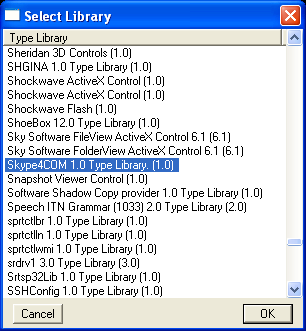
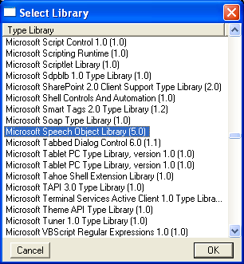

Call GOOG-411 with the Skype COM interface and Microsoft Speech API
===============================================================================
Here you will call Google's 411 service using Skype's COM interface and interact with the service using the Microsoft Speech API.  We first presented this screencast as part of a three-hour session on `Automating Windows Applications using win32com <http://us.pycon.org/2008/tutorials/AutomatingWindows>`_ during the `2008 Python Conference <http://us.pycon.org/2008>`_ in Chicago, Illinois.

.. raw:: html

    <object width="560" height="340"><param name="movie" value="http://www.youtube.com/v/7Kj0A7dQGxc&hl=en&fs=1&rel=0"></param><param name="allowFullScreen" value="true"></param><param name="allowscriptaccess" value="always"></param><embed src="http://www.youtube.com/v/7Kj0A7dQGxc&hl=en&fs=1&rel=0" type="application/x-shockwave-flash" allowscriptaccess="always" allowfullscreen="true" width="560" height="340"></embed></object>

Requirements
------------
* `Skype <http://skype.com>`_
* `Python <http://python.org>`_
* `Python for Windows extensions <http://sourceforge.net/projects/pywin32>`_
* `IPython <http://ipython.scipy.org/>`_

Example
-------
::

    # Import system modules
    from win32com.client import makepy, Dispatch

    # Expose type libraries
    makepy.GenerateFromTypeLibSpec('Skype4COM 1.0 Type Library.') # Note the period at the end
    makepy.GenerateFromTypeLibSpec('Microsoft Speech Object Library')

    # Call GOOG-411 through Skype
    skype = Dispatch('Skype4COM.Skype')
    skype.Client.Start()
    skype.PlaceCall('+18004664411')       # 1 800 GOOG 411

    # Talk using the Microsoft Speech API
    speech = Dispatch('SAPI.SpVoice')
    import time; time.sleep(10)           # Wait for voice prompt
    speech.Speak('Chicago Illinois')

Access COM interface
--------------------
The Component Object Model (COM) enables automation by giving programming languages access to functions inside an application.  For example, we will use Skype's COM interface to write a program that makes a telephone call using Skype's ``PlaceCall()`` function.  Mark Hammond's Python for Windows extensions brings COM to Python.
::

    from win32com.client import Dispatch
    skype = Dispatch('Skype4COM.Skype')

Though at this point we can access all of the functions of Skype's COM interface, the directory of functions and constants is invisible to Python's inspection methods until we generate the type libraries.

Generate type libraries
-----------------------
To properly expose the COM interface of Skype and the Microsoft Speech API in Python, you should generate the type libraries.
::

    from win32com.client import makepy
    makepy.GenerateFromTypeLibSpec('Skype4COM 1.0 Type Library.') # Note the period at the end
    makepy.GenerateFromTypeLibSpec('Microsoft Speech Object Library')

Generating type libraries reveals the application's COM objects to Python's inspection methods and empowers IPython's autocompletion feature.
::

    from win32com.client import Dispatch
    skype = Dispatch('Skype4COM.Skype')

    dir(skype)
    skype.         # IPython only (press period and TAB to see member variables and methods)
    skype?         # IPython only (see arguments and documentation)
    skype??        # IPython only (see source code)

    from win32com.client import constants
    dir(constants)

If you do not know the name of your application's type library, you can run ``makepy`` manually.  You can find ``makepy.py`` in the ``Lib\site-packages\win32com\client`` subdirectory of your Python installation.
::

   C:\Python26\Lib\site-packages\win32com\client\makepy.py

Run ``makepy.py`` and select ``Skype4COM 1.0 Type Library``.

Run ``makepy.py`` again and select ``Microsoft Speech Object Library``.

Call and talk
-------------
Import the Dispatch method for connecting to COM interfaces.
::
    
    from win32com.client import Dispatch

Load Skype's COM API.
::

    skype = Dispatch('Skype4COM.Skype')

Start Skype.
::

    skype.Client.Start()

Dial GOOG-411.
::

    skype.PlaceCall('+18004664411')

Load Microsoft's Speech API.
::

    speech = Dispatch('SAPI.SpVoice')

Talk to GOOG-411.
::

    speech.Speak('Chicago Illinois')

Links
-----
* `Automating Windows Applications using win32com <http://us.pycon.org/2008/tutorials/AutomatingWindows>`_
* `Skype's COM interface <https://developer.skype.com/Docs/Skype4COM>`_
* `Google's 411 service <http://www.google.com/goog411>`_
