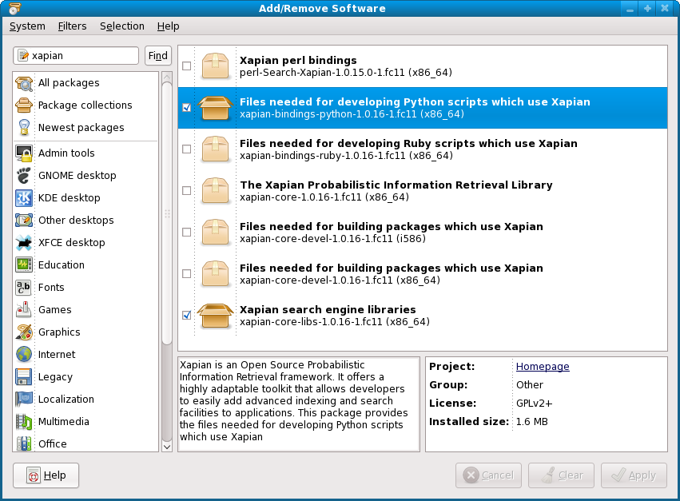
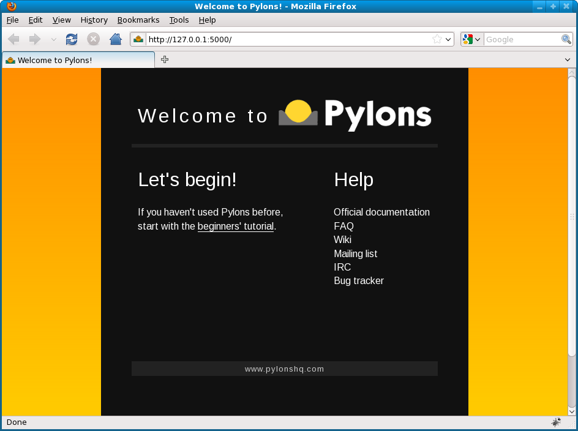
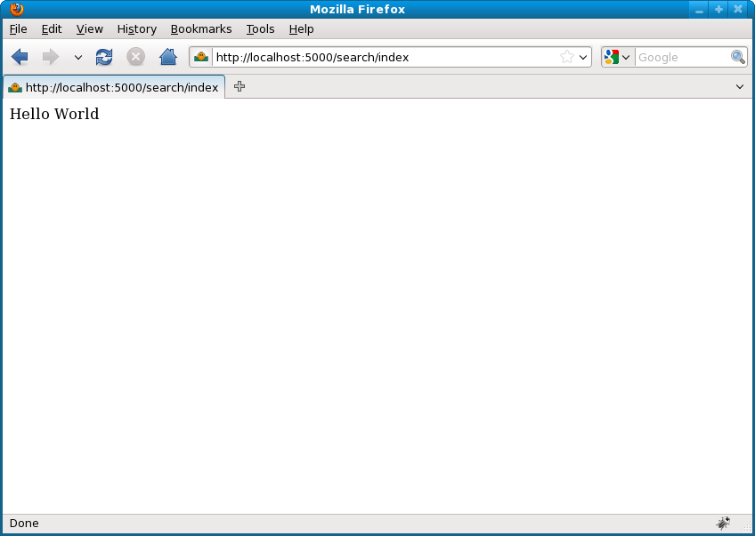
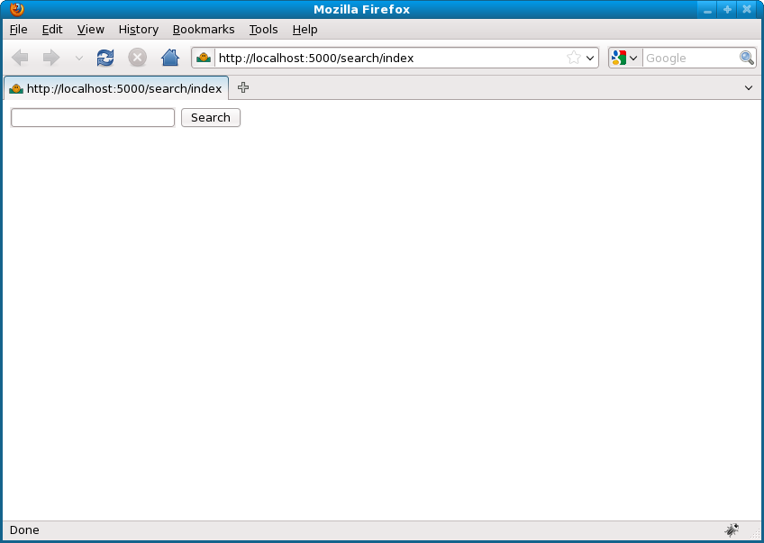
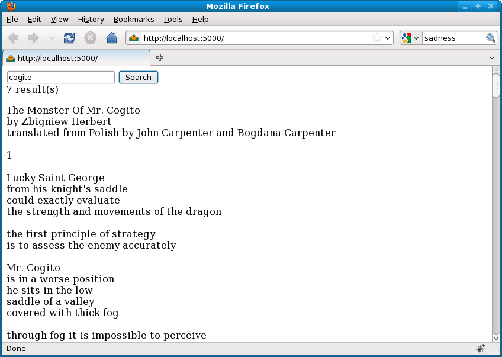
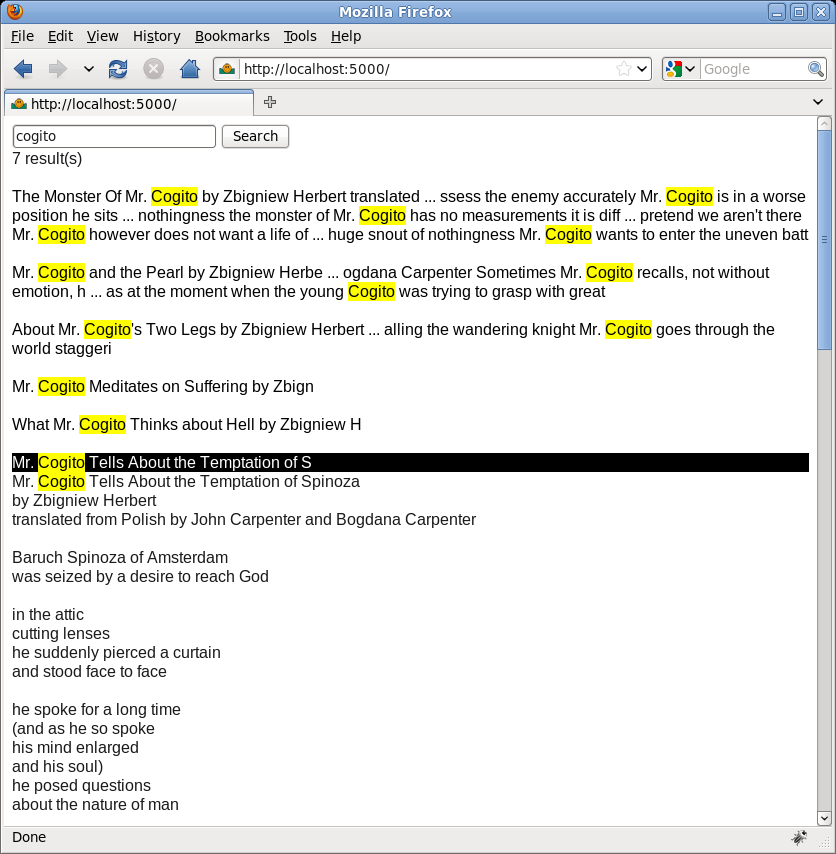
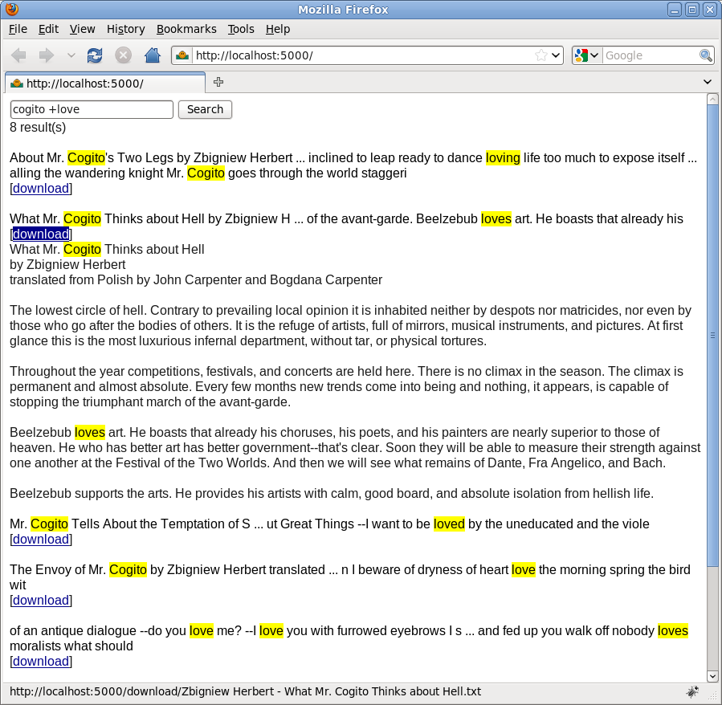
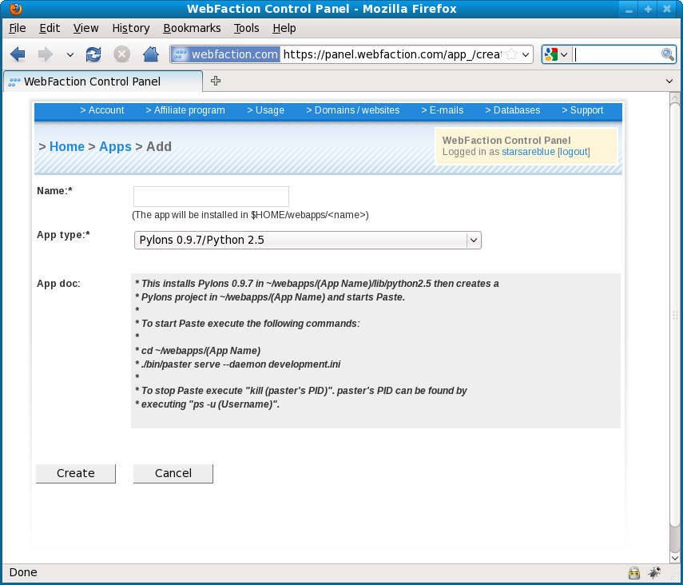
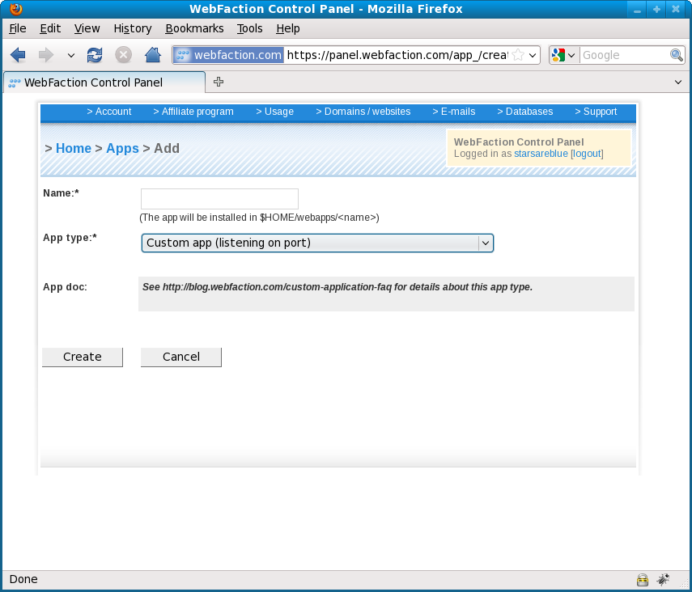

Build a document search engine using Xapian and Pylons
======================================================
It is now easy to set up a powerful search engine using open source libraries.  In this tutorial, we will create a document search engine from scratch using Python bindings to a fast C++ search engine library called Xapian and deploy it using the Pylons web framework on the Python-friendly web hosting provider `WebFaction <http://www.webfaction.com/?affiliate=starsareblue>`_.

A version of this system has been deployed at the Technology Commercialization Office at the Research Foundation of the City University of New York to keep track of email and attachments across multiple mailboxes.  We used Python's `imaplib <http://docs.python.org/library/imaplib.html>`_ module and crontab to download and index email and attachments on a regular basis.

Requirements
------------
* `Python <http://python.org>`_
* `IPython <http://ipython.scipy.org>`_
* `Xapian <http://xapian.org>`_
* `Pylons <http://pylonshq.com>`_, documented by James Gardner at http://pylonsbook.com
* `jQuery <http://jquery.com>`_
* `Firebug <http://getfirebug.com>`_

Command-line experimentation
----------------------------

Install Xapian
^^^^^^^^^^^^^^
Xapian is available on most platforms including Linux, Mac OS X and Windows.

Install Xapian on Fedora Linux
""""""""""""""""""""""""""""""
On Fedora 11, the easiest way to install Xapian is through the graphical interface.  Go to ``System > Administration > Add/Remove Software`` and search for *xapian*.  Make sure to install both the core libraries and their Python bindings: xapian-core-libs, xapian-bindings-python.

You can also install via the terminal.
::

    su
    yum install xapian-core-libs xapian-bindings-python

Install Xapian on Ubuntu
""""""""""""""""""""""""
On Ubuntu, the easiest way to install Xapian is through the graphical interface.  Go to ``Add/Remove Applications`` and search for *xapian*.  Make sure to install both the core libraries and their Python bindings: xapian-core, xapian-bindings-python.

You can also install via the terminal.
::

    apt-get install xapian-core xapian-bindings-python

Query documents from the command-line
^^^^^^^^^^^^^^^^^^^^^^^^^^^^^^^^^^^^^
Most of the work in a query happens before the query itself, when the documents are indexed for potential keywords.  The quality of indexing determines the speed of the search engine.

Index documents
"""""""""""""""
Download the :download:`collection of poems by Zbigniew Herbert <files/zbigniew-herbert.zip>`.
::
    
    wget http://invisibleroads.com/tutorials/_downloads/zbigniew-herbert.zip
    unzip zbigniew-herbert.zip
    cd zbigniew-herbert

Start IPython.
::

    ipython

Create a new Xapian database in a new folder.  Remember the location of this database; we will use the path later when building the web interface.
::

    # Import the os module for file system management
    import os
    # Set the database path
    databasePath = os.path.abspath('xapian-database')
    # Make a folder at the database path
    os.mkdir(databasePath)

    # Import Xapian's Python bindings
    import xapian
    # Create the Xapian database
    database = xapian.WritableDatabase(databasePath, xapian.DB_CREATE_OR_OPEN)

Prepare document indexer and set the word stemmer to the English language.
::

    # Initialize indexer
    indexer = xapian.TermGenerator()
    # Set word stemmer to English
    indexer.set_stemmer(xapian.Stem('english'))

Index each text document using Python's standard glob module.
::

    # Import the glob module for file system browsing
    import glob
    # Specify the value slot to store each document's file name
    xapian_file_name = 0

    # For each text file,
    for filePath in glob.glob('*.txt'):
        # Load content
        content = open(filePath).read()
        # Prepare document
        document = xapian.Document()
        document.set_data(content)
        # Store fileName
        fileName = os.path.basename(filePath)
        document.add_value(xapian_file_name, fileName)
        # Index document
        indexer.set_document(document)
        indexer.index_text(content)
        # Store indexed content in database
        database.add_document(document)

    # Save changes
    database.flush()

Using ``WritableDatabase.add_document(document)`` will auto-assign a documentID to document.  If you want to specify the documentID, e.g. to match documentIDs in the Xapian database with documentIDs from an external datasource such as MySQL or PostgreSQL, use ``WritableDatabase.replace_document(documentID, document)`` instead.  To see help on these methods, type the following in IPython:
::

    database.add_document?
    database.replace_document?

Note that for speed reasons, Xapian tries to do as much indexing in memory as possible before writing the indices to the hard disk: 10000 documents at a time by default.  If your memory is limited, as is the case with shared web hosting accounts, you may want to limit the number of documents held in memory by setting the ``XAPIAN_FLUSH_THRESHOLD`` environment variable to a smaller number such as 1000 before calling your indexing script.

Query documents
"""""""""""""""
Now we will query documents using our generated indices and Xapian's powerful query semantics.  Define a function to parse our query and return results from the database.
::
    
    def search(queryString):
        # Parse query string
        queryParser = xapian.QueryParser()
        queryParser.set_stemmer(xapian.Stem('english'))
        queryParser.set_database(database)
        queryParser.set_stemming_strategy(xapian.QueryParser.STEM_SOME)
        query = queryParser.parse_query(queryString)
        # Set offset and limit for pagination
        offset, limit = 0, database.get_doccount()
        # Start query session
        enquire = xapian.Enquire(database)
        enquire.set_query(query)
        # Display matches
        matches = enquire.get_mset(offset, limit)
        for match in matches:
            print '==================='
            print 'rank=%s, documentID=%s' % (match.rank, match.docid)
            print '-------------------'
            print match.document.get_data()
        print '==================='
        print 'Number of documents matching query: %s' % matches.get_matches_estimated()
        print 'Number of documents returned: %s' % matches.size()

Experiment with some searches.  Note that singular keywords match plural keywords and verbs match their different conjugations because words are stemmed automatically.
::

    # Return documents containing a single keyword
    search('footstep')
    search('sings')

Boolean keywords such as AND NOT OR are supported.  These must be specified using CAPITAL LETTERS and you can combine these expressions into parenthesis.  You can also use the shorthand +/- notation popularized by Google.  The plus sign (+) prepended directly to a keyword tells Xapian that all results must contain that keyword.  The minus sign (-) tells Xapian to exclude results that contain that keyword.
::

    # Return documents containing at least one keyword (logical OR)
    search('country poison')
    search('country OR poison')
    # Return documents containing both keywords (logical AND)
    search('+country +poison')
    search('country AND poison')
    # Return documents containing one keyword but not the other (logical NOT)
    search('+country -poison')
    search('country NOT poison')
    # Use parentheses to group expressions
    search('(footstep OR country) AND cogito')

Xapian supports searches for exact phrases, proper names and adjacency queries.
::

    # Enclose your phrase in quotation marks
    search('"footsteps going down"')
    # Capitalize proper names
    search('Cogito')
    # Match documents that have words in close proximity
    search('money NEAR jobs NEAR dreams')

For more information, please refer to the Xapian documentation on `queries <http://xapian.org/docs/queryparser.html>`_.

The following sections show you how to order or limit your searches based on extra criteria.

Order documents by date using documentID
""""""""""""""""""""""""""""""""""""""""
Suppose you wanted to be able to order your results by date.  If you can index the documents in order by date, then you can use a very efficient sort by documentID.
::

    enquire.set_weighting_scheme(Xapian::BoolWeight())
    enquire.set_docid_order(Xapian::Enquire::DESCENDING) # Newest first
    enquire.set_docid_order(Xapian::Enquire::ASCENDING)  # Oldest first

Order documents by date using value
"""""""""""""""""""""""""""""""""""
However, if you cannot guarantee that you will index documents in the same order as their date, then you can store the date as a value associated with the document.  For example, when indexing mail downloaded from an IMAP server, there is no guarantee that you will be receiving messages in the order that they were sent.  Xapian has empty slots associated with each document that you can use to store strings or numbers converted into strings.  We will use the ``xapian.Document.add_value()`` method.
::

    # Create a document
    document = xapian.Document()
    # Use slot #1 for date and time
    xapian_when = 1
    # Store the date and time
    document.add_value(xapian_when, '20090704153011')
    # Retrieve the date and time
    document.get_value(xapian_when)

Let's update each document our database with a random date.  Note that the first documentID is 1.
::

    # Import the random module that we will use to assign dates randomly
    import random
    # Import the datetime module that we will use to convert dates to strings
    import datetime
    # Set constants
    xapian_when = 1
    # Set candidate dates
    today = datetime.datetime.now()
    tomorrow = today + datetime.timedelta(days=1)
    yesterday = today - datetime.timedelta(days=1)
    dates = today, tomorrow, yesterday
    # For each document,
    for documentID in xrange(1, database.get_doccount() + 1):
        # Load document
        document = database.get_document(documentID)
        # Get random date
        documentWhen = random.choice(dates)
        # Store the date and time
        document.add_value(xapian_when, documentWhen.strftime('%Y%m%d%H%M%S'))
        # Save document in database
        database.replace_document(documentID, document)

Retrieve the date and time of the first document.
::
    
    database.get_document(1).get_value(xapian_when)

We add the following line to tell Xapian to sort by the value stored in ``xapian_when``.
::

    enquire.set_sort_by_value(xapian_when)

Redefine ``search()`` to include an option for sorting by date.
::

    def search(queryString, byDate=False, withContent=True):
        # Parse query string
        queryParser = xapian.QueryParser()
        queryParser.set_stemmer(xapian.Stem('english'))
        queryParser.set_database(database)
        queryParser.set_stemming_strategy(xapian.QueryParser.STEM_SOME)
        query = queryParser.parse_query(queryString)
        # Set offset and limit for pagination
        offset, limit = 0, database.get_doccount()
        # Start query session
        enquire = xapian.Enquire(database)
        enquire.set_query(query)
        # !!! Sort by date
        if byDate:
            enquire.set_sort_by_value(xapian_when)
        # Display matches
        matches = enquire.get_mset(offset, limit)
        for match in matches:
            print '==================='
            print 'rank=%s, documentID=%s' % (match.rank, match.docid)
            print '-------------------'
            if withContent:
                print match.document.get_data()
            documentWhen = match.document.get_value(xapian_when)
            print datetime.datetime.strptime(documentWhen, '%Y%m%d%H%M%S').strftime('%A, %B %d, %Y %I:%M%p')
        print '==================='
        print 'Number of documents matching query: %s' % matches.get_matches_estimated()
        print 'Number of documents returned: %s' % matches.size()

Search and order by date in descending order.  Note that sometimes limiting the number of results returned by your query can lead to the documents within a result set to be ordered approximately by date and you may need to manually resort results within a result set although the date ordering is accurate when considered across pages.
::

    search('cogito', byDate=True, withContent=False)

Filter documents by number using value
""""""""""""""""""""""""""""""""""""""
It is also possible to filter results strictly based on some numerical or string value.  

For example, you may want to designate certain documents as private and viewable only by the owner of that document.  Suppose we assign to each document a number called ownerID that indicates the owner of that document.  When assigning numbers as values to a document, you must serialise the value to ensure that values are compared as numbers rather than as strings, e.g. ``sorted(['2', '100']) = ['100', '2']``.

Since we used slot #1 to store the date, let us use slot #2 to store the ownerID of the document, with zero indicating that the document is public.
::

    # The documentIndex is the unique index of the document in the Xapian database
    documentIndex = 1
    # The xapian_owner_id is the number of the slot we are using to store ownerID
    xapian_owner_id = 2
    # The ownerID is zero for public documents
    ownerID = 0
    # Get document
    document = database.get_document(documentIndex)
    # Store ownerID
    document.add_value(xapian_owner_id, xapian.sortable_serialise(ownerID))
    # Retrieve ownerID
    xapian.sortable_unserialise(document.get_value(xapian_owner_id))

Let us randomly assign different ownerIDs.
::

    # Import the random module that we will use to assign dates randomly
    import random
    # Set constants
    xapian_owner_id = 2
    # For each document,
    for documentID in xrange(1, database.get_doccount() + 1):
        # Load document
        document = database.get_document(documentID)
        # Get random ownerID from 0=public, 1=owner1, 2=owner2
        ownerID = random.choice(xrange(3))
        # Store the ownerID
        document.add_value(xapian_owner_id, xapian.sortable_serialise(ownerID))
        # Save document in database
        database.replace_document(documentID, document)

To filter by ownerID, we define a class derived from ``xapian.MatchDecider`` that will be passed into ``enquire.get_mset()``.
::

    class MatchDecider(xapian.MatchDecider):
        def __init__(self, owner_id):
            xapian.MatchDecider.__init__(self)
            self.owner_id = owner_id
        def __call__(self, document):
            privacy = xapian.sortable_unserialise(document.get_value(xapian_owner_id))
            return privacy == 0 or privacy == self.owner_id

Here is the revised line that tells Xapian to filter by ownerID.
::

    matches = enquire.get_mset(offset, limit, None, MatchDecider(ownerID))

Let's redefine the search function to enable filtering by ownerID.
::

    def search(queryString, byDate=False, withContent=True, ownerID=None):
        # Parse query string
        queryParser = xapian.QueryParser()
        queryParser.set_stemmer(xapian.Stem('english'))
        queryParser.set_database(database)
        queryParser.set_stemming_strategy(xapian.QueryParser.STEM_SOME)
        query = queryParser.parse_query(queryString)
        # Set offset and limit for pagination
        offset, limit = 0, database.get_doccount()
        # Start query session
        enquire = xapian.Enquire(database)
        enquire.set_query(query)
        # Sort by date
        if byDate:
            enquire.set_sort_by_value(xapian_when)
        if ownerID == None:
            matches = enquire.get_mset(offset, limit)
        else:
            # Filter by ownerID
            matches = enquire.get_mset(offset, limit, None, MatchDecider(ownerID))
        # Display matches
        for match in matches:
            # Load
            documentWhen = match.document.get_value(xapian_when)
            documentOwnerID = int(xapian.sortable_unserialise(match.document.get_value(xapian_owner_id)))
            # Display
            print '==================='
            print 'rank=%s, documentID=%s, ownerID=%s' % (match.rank, match.docid, documentOwnerID)
            print '-------------------'
            if withContent:
                print match.document.get_data()
            print datetime.datetime.strptime(documentWhen, '%Y%m%d%H%M%S').strftime('%A, %B %d, %Y %I:%M%p')
        print '==================='
        print 'Number of documents matching query: %s' % matches.get_matches_estimated()
        print 'Number of documents returned: %s' % matches.size()

Run the search with an ownerID argument to filter searches by ownerID.
::

    search('herbert', withContent=False, ownerID=2)

Extract and highlight the parts of a document that match query words
""""""""""""""""""""""""""""""""""""""""""""""""""""""""""""""""""""
In addition to retrieving documents for a query, we want to pinpoint the relevant parts of each matching document.  Xapian uses a linguistic algorithm called stemming to match a query word with most of its grammatical variants.  That means that if we simply search for the query words in the document verbatim, we will miss the grammatical variants that Xapian matched using stemming.

The approach we take here is crude but works for short documents.  We parse the document content to generate a table of document words linked to their stemmed equivalents.
::

    queryParser.parse_query(content)

We then reverse-map each query word to the grammatical variants that actually appear in the document.
::

    documentWords = list(queryParser.unstemlist(queryWord))

Armed with the actual document word matches, we build a regular expression to extract ten characters of text around each match.
::

    searchExpression = r'.{0,10}%s.{0,10}' % '|'.join(documentWords)

Here is some code to illustrate this approach.
::

    # Import regular expression library
    import re

    # IMPORTANT
    # You must run queryParser on the content before calling these functions.
    # queryParser.parse_query(content)

    def extractRelevantText(query, queryParser, content):
        """
        Illustrate the use of unstemming to extract parts of the document 
        that contain keywords from the search query.
        """
        # Initialize
        extracts = []
        # For each query word,
        for queryWord in set(query):
            # Reverse map query words to document words
            documentWords = list(queryParser.unstemlist(queryWord))
            # If the query word is not in the document, skip it
            if not documentWords:
                continue
            # Prepare regular expression using matching document words
            searchExpression = r'.{0,10}%s.{0,10}' % '|'.join(documentWords)
            pattern = re.compile(searchExpression, re.DOTALL | re.IGNORECASE)
            # Extract relevant text
            extracts.extend(pattern.findall(content))
        # Return
        return extracts

    def highlightWords(query, queryParser, content, highlight_template):
        """
        Illustrate the use of unstemming to highlight keywords in the document
        that match the search query.
        """
        # For each query word,
        for queryWord in set(query):
            # Reverse map query words to document words
            documentWords = list(queryParser.unstemlist(queryWord))
            # If the query word is not in the document, skip it
            if not documentWords:
                continue
            # Prepare regular expression using matching document words
            searchExpression = r'(%s)' % '|'.join(documentWords)
            # Compile pattern
            pattern = re.compile(searchExpression, re.IGNORECASE)
            # Highlight matching words
            content = pattern.sub(highlight_template % r'\1', content)
        # Return
        return content

The following code combines extraction and highlighting, while merging overlapping extracts.  Download the :download:`code <files/xapian-search-pylons/query_process_simplified.py>` and save it as ``query_process_simplified.py`` in the folder where you are running IPython.

.. literalinclude:: files/xapian-search-pylons/query_process_simplified.py

We can now update our ``search()`` method to include extraction and highlighting.
::

    # Import system modules
    import os
    import xapian
    import datetime
    # Import custom modules
    from query_process_simplified import TextMachine

    # Load the Xapian database
    databasePath = os.path.abspath('xapian-database')
    database = xapian.WritableDatabase(databasePath, xapian.DB_OPEN)
    # Set slot constants
    xapian_file_name, xapian_when, xapian_owner_id = xrange(3)

    def search(queryString, byDate=False, ownerID=None, extractLength=32):
        # Parse query string
        queryParser = xapian.QueryParser()
        queryParser.set_stemmer(xapian.Stem('english'))
        queryParser.set_database(database)
        queryParser.set_stemming_strategy(xapian.QueryParser.STEM_SOME)
        query = queryParser.parse_query(queryString)
        # Set offset and limit for pagination
        offset, limit = 0, database.get_doccount()
        # Start query session
        enquire = xapian.Enquire(database)
        enquire.set_query(query)
        # Sort by date
        if byDate:
            enquire.set_sort_by_value(xapian_when)
        if ownerID == None:
            matches = enquire.get_mset(offset, limit)
        else:
            # Filter by ownerID
            matches = enquire.get_mset(offset, limit, None, MatchDecider(ownerID))
        # Display matches
        for match in matches:
            # Load
            documentWhen = match.document.get_value(xapian_when)
            documentOwnerID = int(xapian.sortable_unserialise(match.document.get_value(xapian_owner_id)))
            # Display
            print '==================='
            print 'rank=%s, documentID=%s, ownerID=%s, date=%s' % (match.rank, match.docid, documentOwnerID, datetime.datetime.strptime(documentWhen, '%Y%m%d%H%M%S').strftime('%m/%d/%Y'))
            # Process
            content = match.document.get_data()
            extract = TextMachine(extractLength, '*%s*').process(queryString, content)
            print extract.replace('\n', ' ')
        print '==================='
        print 'Number of documents matching query: %s' % matches.get_matches_estimated()
        print 'Number of documents returned: %s' % matches.size()

Search and see highlighted words.
::

    >>> search('knight')
    ===================
    rank=0, documentID=14, ownerID=0, date=07/24/2010
    g the wandering *knight* Mr. Cogito goes
    ===================
    rank=1, documentID=3, ownerID=2, date=07/26/2010
    George from his *knight*'s saddle could
    ===================
    rank=2, documentID=15, ownerID=0, date=07/25/2010
    d apart and the *knight*'s feet in soft
    ===================
    Number of documents matching query: 3
    Number of documents returned: 3

Web application development
---------------------------
Let's take what we learned from the command-line and create a web interface to the search engine.

Install setuptools
^^^^^^^^^^^^^^^^^^
The setuptools Python module is an easy way to install third-party packages such as Pylons.  On Fedora 11, python-setuptools is a YUM package.
::

    su
    yum install python-setuptools

For Windows, you can download `ez_setup.py <http://peak.telecommunity.com/dist/ez_setup.py>`_ and run it using the Python distribution of your choice.

Install Pylons
^^^^^^^^^^^^^^
If you have installed the setuptools module, then you can use ``easy_install``.
::

    su
    easy_install pylons

You might also want to update the ``WebOb`` module.
::

    easy_install -U WebOb==dev

Create a simple search page
^^^^^^^^^^^^^^^^^^^^^^^^^^^
Here you will take the Xapian database you created in the first section and wrap a Pylons web interface around it.

Create Pylons project
"""""""""""""""""""""
Start a new Pylons project.
::

    paster create -t pylons demo

Press ENTER twice to use the default options.
::

    Enter template_engine (mako/genshi/jinja2/etc: Template language) ['mako']: 
    Enter sqlalchemy (True/False: Include SQLAlchemy 0.5 configuration) [False]: 

Set up the application and start the development server.
::

    cd demo
    paster serve --reload development.ini

Go to http://localhost:5000

Most of the files you will be working with are in the ``demo/demo`` subfolder.  Here is a quick overview of the important files and folders:
::
    
    demo/
        config/
            routing.py      Matches URLs with specific controller methods
        controllers/        Defines the core of how the application behaves
        lib/
            base.py         Called before a URL is routed to a controller
        model/
            __init__.py     Defines the application's data objects
        public/             Serves static files
        templates/          Stores templates that are rendered by controller methods
        tests/              Stores test scripts
    development.ini         Configures the development server when used with "paster serve"
    test.ini                Configures the test server when running "nosetest"

Add search page skeleton
""""""""""""""""""""""""
In another terminal, remove the default HTML index page from the ``public`` directory.  If a URL resolves to both an HTML page and a method in a controller, the HTML page has precedence.  We need to remove this HTML file if we want Pylons to acknowledge the custom controller that we will write.
::

    rm demo/public/index.html

Add a controller for our search methods.  This will create the ``search`` controller module.
::

    paster controller search

Run the development server again and go to http://localhost:5000/search/index in your browser.
::

    paster serve --reload development.ini

Add the following modules to the top of ``demo/lib/helpers.py``.  In templates, we can access the ``demo/lib/helpers.py`` module using the shortcut ``${h.XXX}``.  For example, you will see ``${h.url_for('search_query')}`` which tells Pylons to output the URL ``/searches/query`` associated with the route named ``search_query``.
::

    from webhelpers.html.tags import *
    from webhelpers.html import literal
    from webhelpers.util import html_escape
    from routes import url_for

Tell the ``search`` controller what template to render when the user goes to the http://localhost:5000/search/index URL.  Edit ``demo/controllers/search.py`` and replace the ``index()`` method.
::

    # Import pylons modules
    from pylons import request, response, session, tmpl_context as c
    from pylons.controllers.util import abort, redirect_to
    # Import system modules
    import logging; log = logging.getLogger(__name__)
    # Import custom modules
    from demo.lib.base import BaseController, render

    class SearchController(BaseController):

        def index(self):
            # Render template
            return render('/search/index.mako')

Create the skeletal template ``demo/templates/search/index.mako``.
::

    mkdir demo/templates/search
    gvim demo/templates/search/index.mako

Paste the following code into ``demo/templates/search/index.mako``.
::

    <html>
    <head>
        ${h.javascript_link('/files/jquery-1.4.2.min.js')}
        
    </head> 
    <body>      
        <input id=query>
        <input id=button_search type=button value=Search>
    </body>     
    </html>         

Download and move `jQuery <http://jquery.com>`_ into the ``demo/public`` subfolder.
::

    wget http://code.jquery.com/jquery-1.4.2.min.js
    mv jquery-1.4.2.min.js demo/public

Run the development server again and go to http://localhost:5000/search/index in your browser.
::

    paster serve --reload development.ini

If you got lost in this section, you can continue to the next section by :download:`downloading this section's code here <files/xapian-search-pylons-skeleton.zip>`.

Set up Xapian database
""""""""""""""""""""""
We will recreate the database we created in the first section.
::

    # Create folders to store the documents and indices
    mkdir data/documents
    mkdir data/indices
    # Unpack the original documents
    wget http://invisibleroads.com/tutorials/_downloads/zbigniew-herbert.zip
    unzip zbigniew-herbert.zip
    mv zbigniew-herbert/*.txt data/documents
    # Start IPython
    ipython

In Python, index the documents into the Xapian database just as we did in the first section.
::

    # Import system modules
    import os
    import xapian
    import glob

    # Set paths
    indexPath = 'data/indices'
    documentPath = 'data/documents'
    # Specify the value slot to store each document's file name
    xapian_file_name = 0

    # Create the Xapian database
    database = xapian.WritableDatabase(indexPath, xapian.DB_CREATE_OR_OPEN)
    # Initialize indexer
    indexer = xapian.TermGenerator()
    # Set word stemmer to English
    indexer.set_stemmer(xapian.Stem('english'))

    # For each text file,
    for filePath in glob.glob(os.path.join(documentPath, '*.txt')):
        # Load content
        content = open(filePath).read()
        # Prepare document
        document = xapian.Document()
        document.set_data(content)
        # Store fileName
        fileName = os.path.basename(filePath)
        document.add_value(xapian_file_name, fileName)
        # Index document
        indexer.set_document(document)
        indexer.index_text(content)
        # Store indexed content in database
        database.add_document(document)

    # Save changes
    database.flush()

Edit ``development.ini`` and add the index and document paths under ``[app:main]``.
::

    [app:main]
    path_documents = %(here)s/data/documents
    path_indices = %(here)s/data/indices

If you got lost in this section, you can continue to the next section by :download:`downloading this section's code here <files/xapian-search-pylons-index.zip>`.

Define search page behavior
"""""""""""""""""""""""""""
Define explicit routes in ``demo/config/routing.py`` by adding the following lines before the ``return`` statement.  The first argument is a name for the route we can use in our templates, the second argument is the URL itself and  the third and fourth arguments specify the controller and method, respectively.
::

    map.connect('search_index', '/', controller='search', action='index')
    map.connect('search_query', '/query', controller='search', action='query')

Replace ``demo/templates/search/index.mako`` with the following code.
::

    <html>
    <head>
    ${h.javascript_link('/jquery-1.4.2.min.js')}
    

    </head> 
    <body>      
        <input id=query>
        <input id=button_search type=button value=Search>
        

        

    </body>     
    </html>         

Now we need to tell Pylons how to return search results.  Edit ``demo/controllers/search.py`` and add the ``query()`` method.
::

    # Import pylons modules
    from pylons import request, response, session, tmpl_context as c, config
    from pylons.controllers.util import abort, redirect_to
    # Import system modules
    import logging; log = logging.getLogger(__name__)
    import xapian
    import os
    # Import custom modules
    from demo.lib.base import BaseController, render

    class SearchController(BaseController):

        def index(self):
            return render('/search/index.mako')

        def query(self):
            # Load queryString
            queryString = request.GET.get('q', '').strip()
            # If queryString exists,
            if queryString:
                # Connect to database
                try:
                    database = xapian.Database(config['path_indices'])
                except xapian.DatabaseOpeningError:
                    return 'Cannot open database at ' + config['path_indices']
                # Parse query string
                queryParser = xapian.QueryParser()
                queryParser.set_stemmer(xapian.Stem('english'))
                queryParser.set_database(database)
                queryParser.set_stemming_strategy(xapian.QueryParser.STEM_SOME)
                query = queryParser.parse_query(queryString)
                # Set offset and limit for pagination
                offset, limit = 0, database.get_doccount()
                # Start query session
                enquire = xapian.Enquire(database)
                enquire.set_query(query)
                # Display matches
                c.matches = enquire.get_mset(offset, limit)
                # Render
                return render('/search/payload.mako')

Finally, we create the template ``demo/templates/search/payload.mako``.
::

    ${c.matches.get_matches_estimated()} result(s)

    % for match in c.matches:
    

    ${match.document.get_data()}
    

    % endfor

Run the development server and go to http://localhost:5000 in your browser.
::

    paster serve --reload development.ini

When you run a search, you'll see that the results have no line breaks!  Edit the template ``demo/templates/search/payload.mako`` again to convert plain text linebreaks into HTML linebreaks.  We will need to use the ``h.literal()`` method to prevent Mako from escaping the angle brackets.
::

    ${c.matches.get_matches_estimated()} result(s)

    % for match in c.matches:
     
    

    ${h.literal(match.document.get_data().replace('\n', ' '))}
    

     
    % endfor

If you got lost in this section, you can continue to the next section by :download:`downloading this section's code here <files/xapian-search-pylons-search.zip>`.

Add relevant text extraction and keyword highlighting
^^^^^^^^^^^^^^^^^^^^^^^^^^^^^^^^^^^^^^^^^^^^^^^^^^^^^
For this exercise, we will condense each result into relevant snippets and highlight query words.  Modify ``query()`` in ``demo/controllers/search.py`` so that the ``queryString`` is passed to the ``demo/templates/search/payload.mako`` template.
::

    # Import pylons modules
    from pylons import request, response, session, tmpl_context as c, config
    from pylons.controllers.util import abort, redirect_to
    # Import system modules
    import logging; log = logging.getLogger(__name__)
    import xapian
    import os
    # Import custom modules
    from demo.lib.base import BaseController, render

    class SearchController(BaseController):

        def index(self):
            return render('/search/index.mako')

        def query(self):
            # Load queryString
            queryString = request.GET.get('q', '').strip()
            # If queryString exists,
            if queryString:
                # Connect to database
                try:
                    database = xapian.Database(config['path_indices'])
                except xapian.DatabaseOpeningError:
                    return 'Cannot open database at ' + config['path_indices']
                # Parse query string
                queryParser = xapian.QueryParser()
                queryParser.set_stemmer(xapian.Stem('english'))
                queryParser.set_database(database)
                queryParser.set_stemming_strategy(xapian.QueryParser.STEM_SOME)
                query = queryParser.parse_query(queryString)
                # Set offset and limit for pagination
                offset, limit = 0, database.get_doccount()
                # Start query session
                enquire = xapian.Enquire(database)
                enquire.set_query(query)
                # Display matches
                c.matches = enquire.get_mset(offset, limit)
                c.queryString = queryString
                # Render
                return render('/search/payload.mako')

Edit ``demo/templates/search/index.mako`` and add some CSS to the top of the template to color highlighted words, links and folding tabs.  Also add some jQuery code to implement search result hovering and folding.
::

    <html>
    <head>
    
    ${h.javascript_link('/jquery-1.4.2.min.js')}
    

    </head>
    <body class=normalFONT>
        <input id=query>
        <input id=button_search type=button value=Search>
        

        

    </body>
    </html>

Create ``demo/lib/query_process.py`` and add the ``TextMachine`` class we created earlier.
::

    # Import system modules
    import xapian
    import re

    pattern_url = re.compile(r'((?:ftp|http|https|gopher|mailto|news|nntp|telnet|wais|file|prospero|aim|webcal):(?:(?:[A-Za-z0-9$_.+!*(),;/?:@&~=-])|%[A-Fa-f0-9]{2}){2,}(?:#(?:[a-zA-Z0-9][a-zA-Z0-9$_.+!*(),;/?:@&~=%-]*))?(?:[A-Za-z0-9$_+!*();/?:~-]))')

    class TextMachine(object):
        """
        Simplified formatting class for extracting and highlighting parts of
        a document that match a search query.
        """
        
        def __init__(self, extractLength=None, highlightTemplate=None, joinText=' ... ', escape=None):
            self.extractLength = extractLength
            self.highlightTemplate = highlightTemplate
            self.joinText = joinText 
            self.escape = escape

        def process(self, queryString, content):
            # Parse query
            queryParser = xapian.QueryParser()
            queryParser.set_stemmer(xapian.Stem('english'))
            queryParser.set_stemming_strategy(xapian.QueryParser.STEM_SOME)
            query = queryParser.parse_query(queryString)
            # Parse content after replacing non-alphanumeric characters with spaces
            queryParser.parse_query(re.sub('\W', ' ', content).lower())
            # Create search pattern
            documentTerms = sum([list(queryParser.unstemlist(x)) for x in set(query)], [])
            if not documentTerms:
                documentTerms = set(query)
            pattern = re.compile(r'\b(%s)\b' % '|'.join(re.escape(x) for x in documentTerms), re.IGNORECASE)
            # If the user does not want to extract text,
            if self.extractLength == None:
                extract = content
            # If the user wants to extract text and there is a queryString,
            elif queryString:
                # Initialize
                extractIntervals = []
                extractLengthHalved = self.extractLength / 2
                # For each matchInterval,
                for match in pattern.finditer(content):
                    # Prepare
                    mStart = max(0, match.start() - extractLengthHalved)
                    mEnd = min(len(content), match.end() + extractLengthHalved)
                    # Absorb it
                    absorbInterval((mStart, mEnd), extractIntervals)
                # Load extracts
                extract = self.joinText.join(content[eStart:eEnd].strip() for eStart, eEnd in extractIntervals)
            # If the user wants to extract text and there is no queryString,
            else:
                contentLengthHalved = len(content) / 2
                extractLengthHalved = self.extractLength / 2
                extract = content[contentLengthHalved - extractLengthHalved: contentLengthHalved + extractLengthHalved]
            # If the user wants to escape the text,
            if self.escape:
                extract = self.escape(extract)
            # If the user wants to highlight relevant terms and there is a queryString,
            if self.highlightTemplate and queryString:
                extract = pattern.sub(self.highlightTemplate % r'\1', extract)
            # If we are displaying the entire text,
            if self.extractLength == None:
                extract = extract.replace('\n', ' ')
            # Format hyperlinks
            extract = pattern_url.sub(r'<a href="\1" class=linkOFF>\1</a>', extract)
            # Return
            return extract

    def absorbInterval((mStart, mEnd), extractIntervals):
        'Merge overlapping intervals'
        # For each extractInterval,
        for eIndex, (eStart, eEnd) in enumerate(extractIntervals):
            # If the matchInterval is contained in an existing extractInterval,
            if eStart <= mStart and eEnd >= mEnd:
                # Ignore it because we have it already
                return
            # If the matchInterval overlaps the left side of extractInterval,
            elif mEnd > eStart and mEnd < eEnd:
                # Extend the extractInterval in that direction
                extractIntervals[eIndex] = mStart, eEnd
                return
            # If the matchInterval overlaps the right side of extractInterval,
            elif mStart > eStart and mStart < eEnd:
                # Extend the extractInterval in that direction
                extractIntervals[eIndex] = eStart, mEnd
                return
        # The matchInterval does not overlap any existing extractInterval
        extractIntervals.append((mStart, mEnd))

Edit ``demo/templates/search/payload.mako`` and add extraction and highlighting functionality.
::

    <%
    from demo.lib import query_process

    highlightExtract = query_process.TextMachine(extractLength=64,
        highlightTemplate='%s',
        escape=h.html_escape).process

    highlight = query_process.TextMachine(
        highlightTemplate='%s',
        escape=h.html_escape).process

    xapian_file_name = 0
    %>

    ${c.matches.get_matches_estimated()} result(s) 

    % for matchIndex, match in enumerate(c.matches):
    <%
        content = match.document.get_data()
    %>
     
    

        ${h.literal(highlightExtract(c.queryString, content))}
    

    

        ${h.literal(highlight(c.queryString, content))}
    

    % endfor

Run the development server again and go to http://localhost:5000 in your browser.  Enter your query and press ENTER or click Search.  Then click on a search extract to see the detailed result.
::

    paster serve --reload development.ini

If you got lost in this section, you can continue to the next section by :download:`downloading this section's code here <files/xapian-search-pylons-extract.zip>`.

Add link to download document
^^^^^^^^^^^^^^^^^^^^^^^^^^^^^
We will add a link so that users can download the document directly.  This is useful when the original document is in some format such as PDF, XLS, DOC.

First, route the URL that will trigger the download.  Edit ``demo/config/routing.py`` and add the ``search_download`` route before the ``return`` statement.
::

    from pylons import config
    from routes import Mapper

    def make_map():
        map = Mapper(directory=config['pylons.paths']['controllers'], always_scan=config['debug'])
        map.minimization = False

        map.connect('/error/{action}', controller='error')
        map.connect('/error/{action}/{id}', controller='error')

        map.connect('search_index', '/', controller='search', action='index')
        map.connect('search_query', '/query', controller='search', action='query')
        map.connect('search_download', '/download/{fileName}', controller='search', action='download')

        return map

Second, add the link in the template ``demo/templates/search/payload.mako``.  Recall that we stored the fileName in ``xapian_file_name = 0``.
::

    <%
    from demo.lib import query_process

    highlightExtract = query_process.TextMachine(extractLength=64,
        highlightTemplate='%s',
        escape=h.html_escape).process

    highlight = query_process.TextMachine(
        highlightTemplate='%s',
        escape=h.html_escape).process

    xapian_file_name = 0
    %>

    ${c.matches.get_matches_estimated()} result(s) 

    % for matchIndex, match in enumerate(c.matches):
    <%
        content = match.document.get_data()
    %>
     
    

        ${h.literal(highlightExtract(c.queryString, content))}
    

    [<a class=linkOFF href="${h.url_for('search_download', fileName=match.document.get_value(xapian_file_name))}">download</a>] 
    

        ${h.literal(highlight(c.queryString, content))}
    

    % endfor

Third, define the action in the controller.  Edit ``demo/controllers/search.py`` and add the ``download()`` method.  Make sure to import ``pylons.controllers.util.forward`` and ``paste.fileapp.FileApp``.
::

    # Import pylons modules
    from pylons import request, response, session, tmpl_context as c, config
    from pylons.controllers.util import abort, redirect_to, forward
    from paste.fileapp import FileApp
    # Import system modules
    import logging; log = logging.getLogger(__name__)
    import xapian
    import os
    # Import custom modules
    from demo.lib.base import BaseController, render

    class SearchController(BaseController):

        def index(self):
            return render('/search/index.mako')

        def query(self):
            # Load queryString
            queryString = request.GET.get('q', '').strip()
            # If queryString exists,
            if queryString:
                # Connect to database
                try:
                    database = xapian.Database(config['path_indices'])
                except xapian.DatabaseOpeningError:
                    return 'Cannot open database at ' + config['path_indices']
                # Parse query string
                queryParser = xapian.QueryParser()
                queryParser.set_stemmer(xapian.Stem('english'))
                queryParser.set_database(database)
                queryParser.set_stemming_strategy(xapian.QueryParser.STEM_SOME)
                query = queryParser.parse_query(queryString)
                # Set offset and limit for pagination
                offset, limit = 0, database.get_doccount()
                # Start query session
                enquire = xapian.Enquire(database)
                enquire.set_query(query)
                # Display matches
                c.matches = enquire.get_mset(offset, limit)
                c.queryString = queryString
                # Render
                return render('/search/payload.mako')

        def download(self, fileName):
            # Clean fileName for security
            fileName = os.path.basename(fileName)
            # Build filePath
            filePath = os.path.join(config['path_documents'], fileName)
            # If the filePath is a file,
            if os.path.exists(filePath) and os.path.isfile(filePath):
                return forward(FileApp(filePath))

Run the development server again and go to http://localhost:5000 in your browser.  Click on the ``download`` link to download a document.
::

    paster serve --reload development.ini

If you got lost in this section, you can continue to the next section by :download:`downloading this section's code here <files/xapian-search-pylons-download.zip>`.

Deployment via WebFaction
-------------------------
`WebFaction <http://www.webfaction.com/?affiliate=starsareblue>`_ is an awesome Python-friendly web hosting provider.

Install Xapian on WebFaction
^^^^^^^^^^^^^^^^^^^^^^^^^^^^
Credit for this section goes to Matte Noble's blog entry: http://blog.mattenoble.com/articles/guide-to-rails-full-text-search-with-xapian-on-a-shared-hosting-plan

Download and unpack sources.
::

    # Download
    wget http://oligarchy.co.uk/xapian/1.0.16/xapian-core-1.0.16.tar.gz
    wget http://oligarchy.co.uk/xapian/1.0.16/xapian-bindings-1.0.16.tar.gz
    # Unpack
    tar xzvf xapian-core-1.0.16.tar.gz
    tar xzvf xapian-bindings-1.0.16.tar.gz

Install the core libraries and Python bindings into the base path of your `WebFaction <http://www.webfaction.com/?affiliate=starsareblue>`_ account.  You will need to change the values of ``prefix`` and ``PYTHON_LIB`` if you want to install Xapian somewhere else.
::

    # Install core
    cd xapian-core-1.0.16
    ./configure --prefix=$HOME
    make
    make install
    # Install bindings
    cd ../xapian-bindings-1.0.16
    ./configure --prefix=$HOME PYTHON=/usr/local/bin/python2.6 PYTHON_LIB=$HOME/lib/python2.6 --with-python --without-ruby --without-php --without-tcl
    make
    make install

Check that everything has been installed correctly in ``/usr/local/bin/python2.6``.  Start Python and type these commands.
::

    Python 2.6 (r26:66714, Apr 30 2009, 20:04:43) 
    [GCC 4.1.2 20080704 (Red Hat 4.1.2-44)] on linux2
    Type "help", "copyright", "credits" or "license" for more information.
    >>> import xapian
    >>> xapian.version_string()
    '1.0.16'
    

Install Pylons
^^^^^^^^^^^^^^
You can either use `WebFaction <http://www.webfaction.com/?affiliate=starsareblue>`_'s point-and-click Pylons for Python 2.5 installer or choose to create a custom application listening on a port.

Since we want to use Python 2.6 with the latest version of Pylons, we will install it as a custom application listening on a port.

Easy install Pylons.
::

    easy_install-2.6 pylons

Test application
^^^^^^^^^^^^^^^^
Unpack your Pylons application into the directory created by `WebFaction <http://www.webfaction.com/?affiliate=starsareblue>`_'s custom application script.  Make sure to change the port in your server configuration file, e.g. production.ini or development.ini, to match the port that `WebFaction <http://www.webfaction.com/?affiliate=starsareblue>`_ gave you when you were creating your custom application.

Create a website entry through `WebFaction <http://www.webfaction.com/?affiliate=starsareblue>`_'s control panel for your Pylons application.

Start your production server using ``paster serve`` and test your site.
::

    cd webapps/YOUR-APPLICATION-NAME
    paster serve --daemon production.ini

Deploy application
^^^^^^^^^^^^^^^^^^
In my experience, the default ``paster serve`` daemon works pretty well.  You will want to create a ``crontab`` entry to restart the server every twenty minutes.
::

    7,27,47 * * * * cd /home/YOUR-USERNAME/webapps/YOUR-APPLICATION-NAME;kill `cat paster.pid`;/home/YOUR-USERNAME/bin/paster serve --daemon production.ini

There are other options for deploying Pylons applications, such as using ``mod_wsgi`` or ``mod_python``, but the default multithreading configuration can cause problems with Xapian (see http://trac.xapian.org/ticket/185).  It appears Xapian's development team has fixed these threading issues, though.

Configure crontab to index more documents
^^^^^^^^^^^^^^^^^^^^^^^^^^^^^^^^^^^^^^^^^
Your search engine will likely need to update its database regularly and you can use ``crontab`` to schedule these updates.  If you are on a shared hosting plan, your memory usage might be limited, in which case you should be sure to set the XAPIAN_FLUSH_THRESHOLD environment variable before each ``crontab`` entry.
::

    export XAPIAN_FLUSH_THRESHOLD=1000

In our office, we use ``crontab`` to download and index email messages and attachments from all the IMAP accounts we have on file.  Although multiple processes can query a Xapian database, only one process can write to a Xapian database at any time.  This means that if there are aspects of your web interface that involve modifying the Xapian database, then you will need to queue those changes so that they are later executed by a ``crontab`` entry.

Deployment via local server
---------------------------
You can also deploy your Pylons application using the ``paster serve`` script behind Apache.  Assuming that your production server is at port 3000, append the following to the end of your ``/etc/httpd/conf/httpd.conf`` file.
::

    <VirtualHost *>
    ProxyPass / http://localhost:3000/
    ProxyPassReverse / http://localhost:3000/
    ProxyPreserveHost On
    <Proxy *>
        Order deny,allow
        Allow from all
    </Proxy>
    </VirtualHost>

Then restart your Apache server and run the ``paster serve`` script.
::
    
    paster serve --daemon production.ini

Make sure to install a ``crontab`` entry to restart your Pylons server regularly.  For more information about deploying a Pylons application behind Apache, please see `this article <http://wiki.pylonshq.com/display/pylonscookbook/Apache+as+a+reverse+proxy+for+Pylons>`_.
